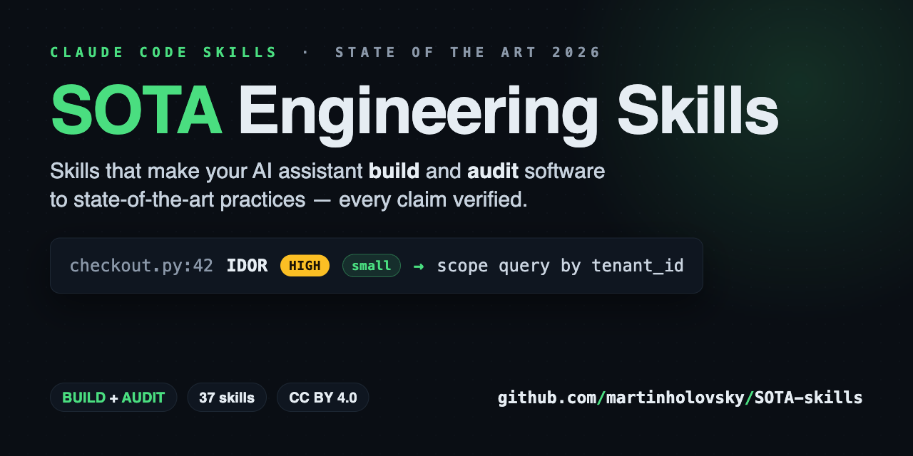
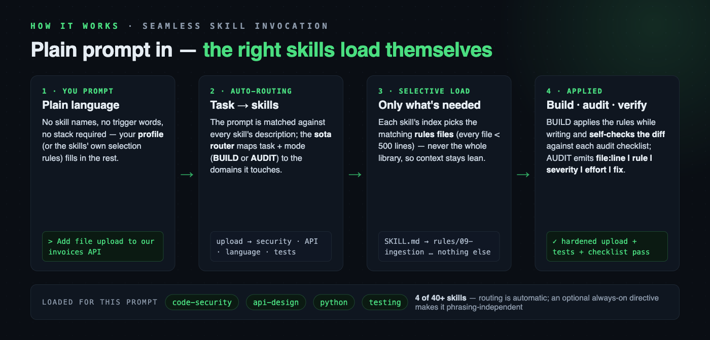
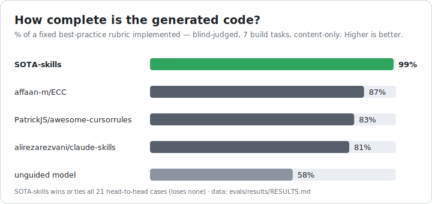

# SOTA Engineering Skills

<p align="center">
  <a href="https://github.com/martinholovsky/SOTA-skills/releases"></a>
  <a href="https://github.com/martinholovsky/SOTA-skills/actions/workflows/ci.yml"></a>
  
  
  <a href="LICENSE"></a>
</p>

<p align="center">
  
</p>

**Make your AI coding assistant build and audit like your most senior engineer.**

Your assistant is brilliant — it just doesn't know your standards, and it forgets the
ones it does know as the task grows long. SOTA-skills fixes both, and the fix is
**measured**: from a bare "build X" prompt, best-practice coverage climbs from **~59%
to ~98% (+0.39)** — the model stops silently dropping tests, rate limiting, structured
logging, and TLS ([see every number →](evals/results/RESULTS.md)).

It works by being a **loop, not a prompt dump**: route in only the rules a task needs,
re-state them every turn, and re-check them *last* before shipping — so the guidance
survives a long context instead of fading into it. That's why it beats a bigger prompt
instead of becoming one. Native on Claude Code; works with Gemini CLI, Codex, and any
agent that reads `AGENTS.md`.

Under the hood: **41 skills (296 files, ~60k lines)** of state-of-the-art 2026
practice, each file under 500 lines so only the matching rules load, every fast-moving
claim web-verified against a primary source.

Two commands to install:

```text
/plugin marketplace add martinholovsky/SOTA-skills
/plugin install sota-skills@sota-skills
```

**Or clone + link** (best if you want a local checkout to read, hack on, or pin).
Skills are discovered from `.claude/skills/` (per project) or `~/.claude/skills/`
(personal, all projects). Clone the repo, then run the installer — it symlinks
every skill (and your profile, if you have one):

```sh
git clone https://github.com/martinholovsky/SOTA-skills && cd SOTA-skills
./scripts/install.sh                 # personal: ~/.claude/skills (all projects)
./scripts/install.sh --project DIR   # one project: DIR/.claude/skills
./scripts/install.sh --copy          # copy instead of symlink (pin a snapshot)
```

Then describe the task in plain language — routing loads the right skills; the
stack comes from your profile or the skills' defaults (naming one is optional):

> Design a multi-tenant invoicing service.

> Run a full audit of this repo — severity, effort, and fix on every finding.



More install options: [Installation](#installation) · more prompts: [Using it](#using-it).

## Contents

- [Standards & practices baked in](#standards--practices-baked-in)
- [Skills](#skills) · [Coverage & non-goals](#coverage--non-goals)
- [Installation](#installation) · [Always-on routing](#always-on-routing-recommended) · [Updating](#updating)
- [Using it](#using-it)
- [Optional setup & integrations](#optional-setup--integrations) — [badge](#badge), [gates](#enforcing-the-gates), [other agents](#other-ai-agents-codex-copilot-gemini-), [status line](#status-line-optional), [plugin extras](#optional-extras-for-plugin-users)
- [Structure](#structure) · [How it works](#how-it-works) · [Conventions](#conventions)
- [Found a gap? Tell us](#found-a-gap-tell-us--its-the-only-signal-we-get) · [Contributing](#contributing) · [License](#license)

**Deeper docs:** [Find it fast (docs index)](docs/INDEX.md) · [Does it work? (measured results)](evals/results/RESULTS.md) · [Why it works](docs/WHY-IT-WORKS.md) · [Keeping rules applied as context fills](docs/CONTEXT-MANAGEMENT.md) · [Roadmap](docs/ROADMAP.md)

## Standards & practices baked in

Findings name the control they violate — not just "this looks wrong":

- **Security** — OWASP Top 10 (2025), ASVS, API & LLM Top 10; findings cite CWE IDs
- **Languages** — all 9 language skills (Rust → Ruby, below) get the same rigor;
  formal standards where they exist: SEI CERT (C, C++, Java), MISRA C/C++, ANSSI Rust
- **Supply chain** — SLSA, Sigstore, in-toto, SBOM (CycloneDX/SPDX), NIST SSDF
- **Cloud & identity** — CIS Benchmarks, NIST 800-207 zero trust, NIST 800-63-4,
  OAuth 2.1, FAPI 2.0, passkeys, SPIFFE
- **Privacy & compliance** — GDPR, CCPA/CPRA, HIPAA, PCI DSS 4.x, SOC 2,
  ISO 27001, EU AI Act, NIS2, DORA
- **Government & regulated** — NIST CSF 2.0, 800-53, 800-171/CMMC, FedRAMP,
  EU Cyber Resilience Act, IEC 62443
- **Threats, detection & AI/ML** — STRIDE, LINDDUN, MITRE ATT&CK & ATLAS,
  NIST 800-61, NIST AI RMF
- **Frontend, mobile & testing** — WCAG 2.2 AA, Core Web Vitals, OWASP MASVS & WSTG

Named standards are the floor. Most of the library is the practice layer no
regulation writes down: cancellation & backpressure, retries with jitter,
circuit breakers, outbox/saga, zero-downtime migrations, measure-first
performance, API evolvability, per-language idioms, SLOs, test-suite health.

**Measured, not asserted** — library vs. an *unguided model* (same model, no
library); clean, blind-judged, stable across samples ([results & method →](docs/WHY-IT-WORKS.md)):

- **Completeness +0.39** — from a bare "build X" prompt, best-practice coverage goes ~59% → ~98% (7 tasks): the model stops silently dropping tests, rate limiting, structured logging, and TLS. Web search likely can't recover this (an agent won't search "should I add rate limiting").
- **Freshness +0.53** — current-2026 facts (RFCs, CVEs, EOLs) 0.44 → 0.97, where an unguided model is *confidently wrong*.
- **Routing +0.10** — the right skills load for the task (0.90 → 1.00), even ones a keyword read misses; with the library, results barely move run-to-run.

And not just vs. an unguided model — **head-to-head against the most popular
guidance libraries on backend build tasks**, SOTA-skills leads on completeness
(content-only, blind-judged; wins or ties all 21 cases, loses none):

<p align="center">
  <picture>
    <source media="(prefers-color-scheme: dark)" srcset="assets/benchmark-dark.svg">
    
  </picture>
</p>

A **five-domain breadth test** shows *when* this edge holds: SOTA-skills leads the
field wherever a base model ships **incomplete** code — production backend in any
language *and* complex/security-sensitive frontend (~+10 pts) — and **ties** where the
base model is already near-complete (simple UI, templated infra). The lead tracks task
difficulty, not the domain — we measure it and say so.
[Full breadth result, consolidated table, method & honest limits →](evals/results/RESULTS.md)

## Skills

| Skill | Covers |
|---|---|
| `sota` | Master router: operating principles, task→skill routing, full-audit workflow + audit methodology (tool matrix, evidence standard, report template) |
| `sota-architecture` | Styles & ADRs, DDD, distributed systems, resilience, scalability, cloud-native, anti-patterns |
| `sota-code-security` | Injection, authn/authz, crypto, web security, resource safety, data exposure, LLM appsec |
| `sota-threat-modeling` | STRIDE/LINDDUN, DFDs & trust boundaries, threat catalogs, risk rating, model reconstruction |
| `sota-secrets-management` | Lifecycle & workload identity, storage backends, app patterns, leak detection, credential types |
| `sota-sandboxing` | Isolation boundaries, seccomp/Landlock/capabilities, containers/microVMs, parsers, AI-agent sandboxing |
| `sota-performance` | Measure-first methodology, algorithms, memory, I/O & network, caching, Web Vitals |
| `sota-async-concurrency` | Concurrency models, races/deadlocks, primitives, event-loop hygiene, cancellation, backpressure |
| `sota-api-design` | REST/HTTP, versioning, GraphQL, gRPC, websockets/SSE/realtime, webhooks, API security & ops |
| `sota-devsecops` | Pipeline hardening, SLSA/Sigstore provenance, dependencies/SBOM, container builds, IaC, admission control |
| `sota-databases` | Modeling & engine choice, zero-downtime migrations, indexes, transactions, reliability, security, pgvector/Qdrant, SurrealDB |
| `sota-frontend-design` | Typography/color, layout, design systems, UX patterns, WCAG 2.2 accessibility, motion design, visual craft |
| `sota-web-frameworks` | React 19/Next.js + Vue 3/Nuxt 4: Server Components & Server Actions, RSC/client boundary, caching (`use cache`/PPR/ISR), hydration correctness, SSR state serialization, Nitro routes, framework CVEs |
| `sota-observability` | Structured logging, metrics, OpenTelemetry tracing, SLOs & alerting, operational readiness |
| `sota-testing` | Test strategy & design, doubles/test data, contract testing, e2e, property/fuzzing/mutation, suite health |
| `sota-llm-engineering` | Evals, prompt/context engineering, RAG, agents & tools, LLM production engineering, data lifecycle |
| `sota-ml-engineering` | Production ML/MLOps (classical, not LLM): training→serving→monitoring, feature stores/registries, leakage & train/serve skew, ML Test Score eval, deployment & rollback, drift/retraining, ML security & governance |
| `sota-cloud-infrastructure` | Accounts/landing zones, cloud IAM, VPC/DNS/CDN setup, compute selection, storage, FinOps, resilience & DR |
| `sota-kubernetes` | Cluster platform security: RBAC & escalation, admission control, GitOps controllers, operators/CRDs, etcd, Helm supply chain, multi-tenancy, Talos/k3s |
| `sota-identity-access` | IdP ops (OIDC/SAML/SCIM), RBAC/ABAC/ReBAC design, joiner-mover-leaver, privileged access & break-glass, SPIFFE, phishing-resistant MFA, AD/Kerberos/ADCS hardening |
| `sota-network-security` | Zero-trust & segmentation, NetworkPolicy depth, service mesh/mTLS, egress control, WAF/edge, DNS/TLS/PKI & cert lifecycle |
| `sota-confidential-computing` | TEEs (SEV-SNP/TDX/CCA, enclaves, confidential GPUs), remote attestation & attest-then-release, confidential K8s (CoCo), FHE/MPC/ZKP |
| `sota-detection-engineering` | Detection-as-code (Sigma/YARA/Falco), SIEM & telemetry coverage, alert tuning/SOAR, threat hunting & intel, deception, incident response, AD attack detection |
| `sota-data-engineering` | Pipelines & orchestration, streaming/CDC, lakehouse & Parquet, data quality/contracts, governance |
| `sota-privacy-compliance` | Data inventory, privacy by design, consent & user rights, GDPR/CCPA/HIPAA/PCI/AI Act, SOC 2/ISO 27001, breach readiness |
| `sota-security-compliance` | Control-frameworks-as-code: NIST CSF 2.0, 800-53, 800-171/CMMC, SSDF, FedRAMP, EU Cyber Resilience Act (SBOM/CVD/updates), ISA/IEC 62443 (OT zones & security levels) |
| `sota-mobile` | Platform/stack choice, offline-first & push, mobile security, performance budgets, store releases, Swift-language rules (Swift 6 concurrency, ARC, SPM) |
| `sota-cli-ux` | Command/flag design, output & exit-code contracts, lifecycle behavior, distribution |
| `sota-shell-scripting` | Bash safety baseline, robustness, script security, CI/entrypoint/Makefile scripts |
| `sota-docs-workflow` | Documentation architecture, API docs & changelogs, code review/PR workflow, commits & releases |
| `sota-ux-writing` | Voice/tone & plain language (ISO 24495-1), microcopy, error & feedback messages, accessible/localizable interface text |
| `sota-copywriting` | Positioning & value props, headlines/landing pages/CTAs, SEO content (E-E-A-T, spam policies), claims & legal trust (FTC, email law) |
| `sota-rust` | Ownership/API design, errors & panics, unsafe discipline, tokio, supply chain, performance, CI |
| `sota-golang` | Errors, package design, goroutine safety, net/http hardening, security, pprof, CI |
| `sota-c-cpp` | RAII/idioms, memory safety & sanitizers, undefined behavior, security (CERT/MISRA, hardening flags), concurrency, CMake/clang-tidy/fuzzing CI, performance |
| `sota-jvm` | Java/Kotlin idioms, null/immutability API design, concurrency (virtual threads, JMM, coroutines), security (deserialization/JNDI/XXE/crypto), GC/JFR/GraalVM, Maven/Gradle supply chain & CI |
| `sota-python` | uv/ruff/typing, idioms, asyncio, security, performance, FastAPI/Django/pytest |
| `sota-javascript-typescript` | Strict TS, idioms, async, Node hardening, security, bundle/React performance, testing |
| `sota-dotnet` | C#/.NET idioms (records, NRT, patterns, spans), disposal/DI design, async (ConfigureAwait/cancellation), security (EF/Dapper, deserialization, ASP.NET Core auth, crypto), GC/Span/AOT, NuGet supply chain & analyzers/CI |
| `sota-php` | strict_types & modern idioms (enums, readonly, match), OWASP security (PDO, output escaping, uploads/LFI, unserialize/Phar, sessions), Composer supply chain, PHPStan/Psalm, OPcache/FPM/JIT |
| `sota-ruby` | Idioms & typing (RBS/Sorbet), security (SQLi, ERB escaping, strong params, Marshal/YAML.load, ReDoS), Bundler supply chain, RuboCop/Brakeman, GVL/Ractors/YJIT |

### Coverage & non-goals

Deliberately **not covered**: Scala/Elixir, standalone C (inside `sota-c-cpp`), platform-engineering/IDP depth. File a *skill request* issue.

## Installation

Both commands are shown at the top — the **plugin** (`/plugin`, auto-updates on
version bump) or **clone + link** (`./scripts/install.sh`, a local checkout to
read, hack on, or pin). A few details on the clone path:

- Skills are discovered from `.claude/skills/` (per project) or `~/.claude/skills/`
  (personal, all projects); `install.sh` symlinks every skill and your profile.
- `--project DIR` scopes to one repo; `--copy` pins a snapshot instead of linking.
- Prefer no script? It only symlinks `skills/*/` into `~/.claude/skills/` — do
  that by hand if you'd rather.

The plugin (or `--copy`) installs the skills; a few extras (routing reminder,
status line, pre-commit gates, AGENTS.md) aren't auto-enabled — see
[Optional extras for plugin users](#optional-extras-for-plugin-users). On first
run the plugin shows a one-time notice pointing there.

### Updating

**Plugin install:** updates ship when the version bumps — `/plugin update
sota-skills@sota-skills` (or `/plugin marketplace update sota-skills`). Git-hosted
marketplaces also check at session start.

**Clone install:** because linking is symlink-based, **existing skills update
the moment you pull** — the symlinks already point at the live files:

```sh
git -C /path/to/SOTA-skills pull
```

To also pick up **newly added** skills (a pull alone won't link a brand-new
skill directory) and prune links to removed ones — pull and re-link at once:

```sh
./scripts/install.sh --update        # git pull --ff-only, then re-link
```

It's idempotent: re-running only links what's new and prunes what's gone, and
never touches symlinks it didn't create (`--copy` snapshots don't auto-update —
re-run to refresh). With always-on routing enabled, a re-run also **refreshes
the managed routing directive and reminder hook in place** when their wording
changes upstream — prompting first, backing up, touching only the managed
block; a hook you customized is left untouched.

### Always-on routing (recommended)

Skill descriptions are matched per prompt, so routing is opt-in and depends on
how you phrase the request. To make the skills apply to **every** session
regardless of wording, pin the routing instruction where Claude Code always
sees it.

**The quick path:** `./scripts/install.sh` offers to set this up for you after
linking the skills — interactive and **dotfiles-aware**: it detects an existing
or symlinked `~/.claude/CLAUDE.md` / `settings.json`, **asks before touching
anything** (recommended answer pre-filled), backs up first, writes *through* a
symlink so dotfiles stay in charge, and uses managed markers so re-runs refresh
the managed block in place and never duplicate it. Use `--routing` to force,
`--no-routing` to skip, `--yes` for non-interactive. Or wire the three layers
by hand:

Three layers, strongest last:

**1. A stack profile.** Copy the template, fill in your stack, and symlink it
into `~/.claude/` so the router finds it in every project (not just this repo):

```sh
cp profiles/example.md.template profiles/<you>.md   # edit it — profiles/*.md is git-ignored
mkdir -p ~/.claude/profiles
ln -sfn "$(pwd)/profiles/<you>.md" ~/.claude/profiles/<you>.md
```

**2. A global directive.** `~/.claude/CLAUDE.md` is loaded into every session,
every project. Add a routing mandate so the skills apply without trigger words:

```md
# Global engineering directive

Always, on every answer: (1) **validate before you assert** — verify any claim
about code, system state, config, versions, or facts against a primary source
(read the file / run the command / fetch official docs) before answering or
proposing, and label anything unverified as such; (2) **keep docs current** —
when you change code/behavior/config, update the affected docs (README,
CHANGELOG, comments, runbooks, AGENTS.md) in the same change, unprompted.

For any task that builds, designs, refactors, debugs, reviews, or audits code —
in any language or repo — consult the `sota` router skill first, load the
matching `sota-*` skills, and apply their rules before acting. This holds even
when I never say "SOTA" or "audit". Treat `~/.claude/profiles/<you>.md` as the
BUILD default and AUDIT baseline, and stop-and-ask on security-relevant choices.
```

**3. (Optional) A per-prompt reminder.** A directive read many turns ago can
fade from a long context; a `UserPromptSubmit` hook in `~/.claude/settings.json`
re-injects it on every prompt:

```json
{
  "hooks": {
    "UserPromptSubmit": [
      { "hooks": [ { "type": "command",
        "command": "echo 'Route code tasks through the sota router and apply the matching sota-* skills; the profile is the stack baseline.'" } ] }
    ]
  }
}
```

No mechanism *forces* a model to run a skill — the three layers feed it
instructions it chooses to follow, making routing reliable, not phrasing-dependent.

## Using it

With always-on routing set up (above), you **don't name anything** — describe
the task in plain language and the right skills load automatically (see
[How it works](#how-it-works)). Name a skill or rule only to *force* a specific
skill, *scope* to one rule file, or *stack* an exact combo.

**Building** — plain prompts; routing picks the skills:

> Design a multi-tenant invoicing service — stack from my profile, or propose one.

> Add a RAG search feature over our docs, and write the evals first.

> Scaffold the GitHub Actions pipeline for this repo: SHA-pinned actions, OIDC,
> SBOM + signing.

> We handle CUI on this service — what does that require of the architecture and
> data stores?

**Auditing** — say the mode ("audit", "review", "harden"):

> Run a full audit of this repo. Static analysis only, current commit, report
> with a prioritized roadmap.

> Audit this PR before I merge it.

> Sweep the repo and git history for secrets — rotate-first recommendations.

> Threat-model this service from the code: DFD, trust boundaries, STRIDE.

> Audit our Kubernetes manifests and Dockerfiles. Severity + effort on every
> finding.

> Why is checkout slow? Profile first — no guessing.

> Review our agent's MCP setup for tool poisoning, rug pulls, and shadowing.

**Naming a skill or rule (optional — to force or scope):**

> Add a websocket endpoint per `sota-api-design` rules/05 (auth-at-upgrade,
> backpressure).

> Is this migration zero-downtime safe? Check `sota-databases` rules/02
> (expand/contract, lock-aware DDL).

> Review test-suite health against `sota-testing` rules/07 (flaky policy,
> coverage ratchets, speed budgets).

> Audit this PR against `sota-code-security` + `sota-golang` before merge.

**Maintaining the library:**

> Refresh the library — re-verify fast-moving claims against current primary
> sources, apply fixes, and update the root `LAST-VERIFIED` stamp.

> Create profiles/<name>.md for my stack: <stores, auth, platform, policies>.

> Add a new skill for <domain>, same structure: SKILL.md + rules/ under 500 lines
> each, claims web-verified.

**Tips:**

- **Say the mode if ambiguous** — "audit/review/harden" vs "build/add/design";
  skills key off those verbs.
- **Scope audits explicitly** — which commit/branch, static-only or may-run-tools,
  time budget ("crown jewels only"). The methodology file asks otherwise.
- **Ask for the report format** — default audit output is executive summary →
  findings by severity → roadmap by risk-reduction-per-effort → positive notes.
- **Re-verify version-sensitive facts** — web-check before pinning any version.

## Optional setup & integrations

Beyond the skills themselves — all opt-in, none required to use the library.

### Badge

Built or audited a project with the library? Ship the attribution
[](https://github.com/martinholovsky/SOTA-skills):

```md
[](https://github.com/martinholovsky/SOTA-skills)
```

### Enforcing the gates

Routing makes the model *apply* the rules; to make them stick regardless of who
(or what) commits, wire them as git hooks. `scripts/init-gates.sh` generates a
SOTA-aligned `.pre-commit-config.yaml` for whatever languages it finds in the
target repo:

```sh
cd /path/to/your/project
/path/to/SOTA-skills/scripts/init-gates.sh        # add --dry-run to preview first
```

It detects Python / Go / Rust / JS-TS / shell by manifest and extension, then
writes the exact tools each skill prescribes — ruff·mypy·pytest·pip-audit,
gofumpt·golangci-lint·govulncheck, clippy·cargo-audit, eslint·tsc·`<pm> audit`,
shellcheck·shfmt, plus gitleaks everywhere. Fast checks (lint, format, secrets)
run on **commit**; heavy ones (type-check, tests, vuln scans) run on **push** —
the split `sota-python` rules/01 §6 and `sota-devsecops` rules/05 require, so
commits stay quick.

It is **idempotent**: re-run it after adding a language and it rewrites only the
block between its `# >>> sota-gates >>>` markers, leaving any hooks you added
yourself in place. The hooks call your project's own toolchain, so install the
per-language tools it lists on exit (and `pre-commit install` if the script
couldn't).

Add `--docs-gate` to also install a pre-commit hook that **blocks a commit which
changes code but updates no docs** (README/CHANGELOG/`docs/`/`*.md`) — so docs
stay current without you having to ask. It writes a small helper to
`.sota/docs-gate.sh`; it's heuristic (a docstring-only edit inside a code file
will trip it) and bypassable with `SKIP=sota-docs-gate git commit`, which is why
it's opt-in.

### Other AI agents (Codex, Copilot, Gemini, …)

The skill *content* is plain Markdown — any model reads it. To route a non-Claude
agent through the library, generate an `AGENTS.md` (the cross-tool open standard
read by Codex, Cursor, Copilot, Gemini CLI, Windsurf, Zed, and more):

```sh
cd /path/to/your/project
/path/to/SOTA-skills/scripts/gen-agents-md.sh        # add --dry-run to preview
```

It writes a thin `AGENTS.md` that carries the operating principles and points the
agent at the installed `skills/` tree — the index is built from each skill's
frontmatter so it stays in sync, and the agent reads the relevant `rules/*.md` on
demand (no rule text is duplicated). Idempotent via a managed block, like the
others; `--skills-dir`/`--output` override the defaults. Claude Code keeps using
the native Skills install above. This repo itself follows the standard:
[`AGENTS.md`](AGENTS.md) is canonical; `CLAUDE.md`/`GEMINI.md` are symlinks.

### Status line (optional)

`scripts/statusline.sh` is a Claude Code status line that shows **which skills
you've actually used this session** — not just how many are installed:

```text
Opus 4.8 │ ctx 63% │ my-service ⎇ main │ skills▸ code-security, testing (2)
```

Claude Code's status-line input doesn't expose loaded skills, but it passes the
transcript path; the script reads back the `Skill` invocations recorded there,
falling back to a count of installed skills before any are used. Wire it up in
`settings.json` (requires `jq`):

```json
"statusLine": { "type": "command", "command": "/path/to/SOTA-skills/scripts/statusline.sh" }
```

### Optional extras (for plugin users)

The plugin installs the skills; it deliberately does **not** touch your global
config or status line — plugins are sandboxed by design, so the imperative setup
the clone installer does can't be automated. To match the clone experience, opt
in to any of these (the scripts ship *with* the plugin, under its cache dir):

- **Always-on routing** — add the `UserPromptSubmit` hook from
  [Always-on routing](#always-on-routing-recommended) so the skills apply without
  trigger words.
- **Status line** — point `settings.json` `statusLine` at the bundled
  `scripts/statusline.sh` (see [Status line](#status-line-optional)).
- **Pre-commit gates** / **AGENTS.md** — run the bundled `scripts/init-gates.sh`
  or `scripts/gen-agents-md.sh` against a project (see
  [Enforcing the gates](#enforcing-the-gates) and
  [Other AI agents](#other-ai-agents-codex-copilot-gemini-)).

The quickest path: just ask Claude to **"set up the SOTA optional extras"** — the
first-run notice prompts for exactly this, and Claude will walk you through them.

## Structure

```
skills/
  sota/                          # master router — start here
    SKILL.md                     # routing, operating principles, workflows
    rules/
      01-audit-methodology.md    # how to audit: tooling, evidence, reporting
  sota-<domain>/
    SKILL.md                     # when to use, BUILD/AUDIT workflows,
                                 # severity conventions, rules index, top-10
    rules/
      NN-<topic>.md              # ~80–350 lines each, ends with an Audit checklist
      ...
profiles/
  <user>.md                      # personal stack defaults consulted by router
```

Every skill works in two modes:

- **BUILD** — apply the rules while designing/writing code.
- **AUDIT** — review existing code; findings are emitted as
  `file:line | rule violated | severity (Critical/High/Medium/Low/Info) |
  effort (trivial/small/medium/large) | fix`.

Two cross-cutting pieces live outside the domain skills:

- `skills/sota/rules/01-audit-methodology.md` — how to run an audit: scoping,
  a verified static-analysis tool matrix, the evidence standard, and the report
  template (executive summary → findings → roadmap by risk-reduction-per-effort).
- `profiles/` — per-user stack profiles: the default in BUILD mode, the
  expected baseline in AUDIT mode — keeping the library generic and shareable.

## How it works

Claude Code matches your prompt against each skill's frontmatter description
and loads what's relevant automatically — you don't have to name a skill.
Naming one (or the `sota` router) just makes the routing explicit. From there:

1. The skill's `SKILL.md` loads first (workflows, severity conventions, an
   index of its `rules/` files). Only the rules files matching your task are
   read — never the whole library.
2. **BUILD mode** applies the rules while writing code and self-checks the
   diff against each loaded rules file's Audit checklist before presenting it.
3. **AUDIT mode** hunts violations and reports findings as
   `file:line | rule | severity | effort | fix`. Full audits follow
   `sota/rules/01-audit-methodology.md` (scoping → inventory → tooling →
   per-domain passes → report with a prioritized roadmap).
4. If `profiles/<you>.md` exists, its stack choices are BUILD defaults and the
   AUDIT baseline (deviations get flagged).

## Conventions

- Every rules file ends with an **Audit checklist** (yes/no questions, often
  with grep/lint patterns to hunt violations).
- Severity scale everywhere: **Critical** (exploitable/data loss) · **High**
  (fix this sprint) · **Medium** (bounded impact) · **Low** (hygiene) ·
  **Info** (observations, no direct risk). Each finding also carries an
  **effort** estimate (trivial/small/medium/large) so remediation can be
  sequenced by risk-reduction-per-effort.
- Each SKILL.md carries a **top-10 non-negotiables** list — apply these
  unconditionally; load detailed rules files only as the task demands.
- Borderline severities state the deciding assumption; unconfirmed findings
  are marked "needs verification", never asserted.

## Found a gap? Tell us — it's the only signal we get

This library has **no telemetry**. Nothing reports back, by design. That also
means a wrong rule, a stale version claim, or a task with no owning skill stays
in the library for everyone until a human says so.

If a skill was wrong, outdated, or missing when you needed it:
[**open an issue**](https://github.com/martinholovsky/SOTA-skills/issues/new/choose)
(bad-guidance / skill-request templates — both take about a minute). Dangerous or
security-sensitive guidance goes to a [private advisory](SECURITY.md) instead.

The assistant will usually flag these itself: the router tells it to surface a
one-line note when the library lets you down, rather than papering over it.

If it saved you time, a ⭐ helps other engineers find it.

## Contributing

See [CONTRIBUTING.md](CONTRIBUTING.md). The short version: keep skills generic,
verify fast-moving claims against primary sources, keep every file ≤ 500 lines,
and end each rules file with an audit checklist. These are enforced by
`scripts/check-invariants.sh` (pre-commit + CI) plus gitleaks (full-history
scan in CI; per-commit via the pre-commit hook). Security issues
and conduct: [SECURITY.md](SECURITY.md), [CODE_OF_CONDUCT.md](CODE_OF_CONDUCT.md).

## License

© 2026 Martin Holovsky. Licensed under [CC BY 4.0](LICENSE) — Creative Commons
Attribution 4.0 International. Use, adapt, and share freely (including
commercially); just give attribution: *"SOTA Engineering Skills by Martin
Holovsky, CC BY 4.0."*

`profiles/` holds personal stack profiles and is git-ignored except
`profiles/example.md.template` — copy that to `profiles/<you>.md` and edit it;
your real profile stays local and is never committed.
