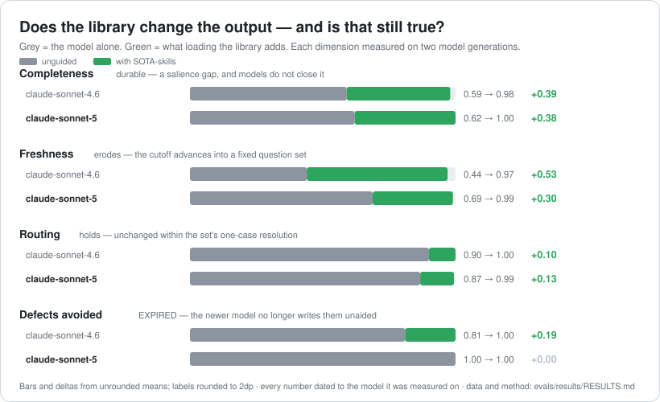

# SOTA Engineering Skills

<p align="center">
  <a href="https://github.com/martinholovsky/SOTA-skills/releases"></a>
  <a href="https://github.com/martinholovsky/SOTA-skills/actions/workflows/ci.yml"></a>
  
  
  <a href="LICENSE"></a>
</p>

<p align="center">
  
</p>

**Make your AI coding assistant build and audit like your most senior engineer.**

Your assistant is brilliant — it just doesn't know your standards, and it forgets the
ones it does know as the task grows long. SOTA-skills fixes both, and the fix is
**measured**: from a bare "build X" prompt, best-practice coverage climbs from **~59%
to ~98% (+0.39)** — the model stops silently dropping tests, rate limiting, structured
logging, and TLS ([see every number →](evals/results/RESULTS.md)).

It works by being a **loop, not a prompt dump**: route in only the rules a task needs,
re-state them every turn, and re-check them *last* before shipping — so the guidance
survives a long context instead of fading into it. That's why it beats a bigger prompt
instead of becoming one. Native on Claude Code; works with Gemini CLI, Codex, and any
agent that reads `AGENTS.md`.

Under the hood: **41 skills (303 files, ~65k lines)** of state-of-the-art 2026
practice, each **instruction** file under 500 lines so only the matching rules load —
the cap applies to `skills/**` alone, never to README/CHANGELOG/`docs/` — every fast-moving
claim web-verified against a primary source.

Two commands to install:

```text
/plugin marketplace add martinholovsky/SOTA-skills
/plugin install sota-skills@sota-skills
```

**Or clone + link** (best if you want a local checkout to read, hack on, or pin).
Skills are discovered from `.claude/skills/` (per project) or `~/.claude/skills/`
(personal, all projects). Clone the repo, then run the installer — it symlinks
every skill (and your profile, if you have one):

```sh
git clone https://github.com/martinholovsky/SOTA-skills && cd SOTA-skills
./scripts/install.sh                 # personal: ~/.claude/skills (all projects)
./scripts/install.sh --project DIR   # one project: DIR/.claude/skills
./scripts/install.sh --copy          # copy instead of symlink (pin a snapshot)
```

The installer colour-codes what it did (`✓` done · `↻` changed or act on this ·
`·` no-op) and drops to plain ASCII when the output is not a terminal, on a
non-UTF-8 locale, on `TERM=dumb`, or with `NO_COLOR` set — `--color=always|never|auto`
(or `--no-color`) overrides the detection either way.

Then describe the task in plain language — routing loads the right skills; the
stack comes from your profile or the skills' defaults (naming one is optional):

> Design a multi-tenant invoicing service.

> Run a full audit of this repo — severity, effort, and fix on every finding.


More install options: [Installation](#installation) · more prompts: [Using it](#using-it).

## Contents

- [Standards & practices baked in](#standards--practices-baked-in) · [What the audit hunts that a scanner can't](#what-the-audit-hunts-that-a-scanner-cant) · [How the numbers are kept honest](#how-the-numbers-are-kept-honest)
- [Skills](#skills) · [Coverage & non-goals](#coverage--non-goals)
- [Installation](#installation) · [Always-on routing](#always-on-routing-recommended) · [Updating](#updating)
- [Using it](#using-it)
- [Optional setup & integrations](#optional-setup--integrations) — [badge](#badge), [gates](#enforcing-the-gates), [other agents](#other-ai-agents-codex-copilot-gemini-), [status line](#status-line-optional), [plugin extras](#optional-extras-for-plugin-users)
- [Structure](#structure) · [How it works](#how-it-works) · [Conventions](#conventions)
- [Found a gap? Tell us](#found-a-gap-tell-us--its-the-only-signal-we-get) · [Contributing](#contributing) · [License](#license)

**Deeper docs:** [Find it fast (docs index)](docs/INDEX.md) · [Does it work? (measured results)](evals/results/RESULTS.md) · [Why it works](docs/WHY-IT-WORKS.md) · [Why some lifts expire and others don't](docs/WHY-SALIENCE-LASTS.md) · [Keeping rules applied as context fills](docs/CONTEXT-MANAGEMENT.md) · [Roadmap](docs/ROADMAP.md)

## Standards & practices baked in

Findings name the control they violate — not just "this looks wrong":

- **Security** — OWASP Top 10 (2025), ASVS, API & LLM Top 10; findings cite CWE IDs
- **Languages** — all 9 language skills (Rust → Ruby, below) get the same rigor;
  formal standards where they exist: SEI CERT (C, C++, Java), MISRA C/C++, ANSSI Rust
- **Supply chain** — SLSA, Sigstore, in-toto, SBOM (CycloneDX/SPDX), NIST SSDF
- **Cloud & identity** — CIS Benchmarks, NIST 800-207 zero trust, NIST 800-63-4,
  OAuth 2.1, FAPI 2.0, passkeys, SPIFFE
- **Privacy & compliance** — GDPR, CCPA/CPRA, HIPAA, PCI DSS 4.x, SOC 2,
  ISO 27001, EU AI Act, NIS2, DORA
- **Government & regulated** — NIST CSF 2.0, 800-53, 800-171/CMMC, FedRAMP,
  EU Cyber Resilience Act, IEC 62443
- **Threats, detection & AI/ML** — STRIDE, LINDDUN, MITRE ATT&CK & ATLAS,
  NIST 800-61, NIST AI RMF
- **Frontend, mobile & testing** — WCAG 2.2 AA, Core Web Vitals, OWASP MASVS & WSTG

Named standards are the floor. Most of the library is the practice layer no
regulation writes down: cancellation & backpressure, retries with jitter,
circuit breakers, outbox/saga, double-entry ledgers and the reconciliation
that proves an integration is *complete* rather than merely correct,
zero-downtime migrations, measure-first performance, API evolvability,
per-language idioms, SLOs, test-suite health.

**Measured, not asserted** — library vs. an *unguided model* (same model, no
library); clean, blind-judged, stable across samples ([results & method →](docs/WHY-IT-WORKS.md)).
**Every number below names the model it was measured on**, because a lift can be
overtaken by model progress and then reads as current when it is historical — that
happened to the defect-avoidance row on 2026-08-21 and is stated there rather than
quietly left standing:

<p align="center">
  <picture>
    <source media="(prefers-color-scheme: dark)" srcset="assets/lift-dark.svg">
    
  </picture>
</p>

- **Completeness +0.39 — and it did *not* expire.** Re-measured 2026-08-21 on the current flagship `claude-sonnet-5`: **0.62 → 1.00, +0.38** — unchanged. From a bare "build X" prompt, best-practice coverage goes ~59% → ~98% (7 tasks): the model stops silently dropping tests, rate limiting, structured logging, and TLS. Web search likely can't recover this (an agent won't search "should I add rate limiting"). **Not model-specific, and not stale**: a different-family model (`openai/gpt-5.1`) shows **+0.44** on the same tasks ([cross-model →](evals/results/2026-07-22/CROSS-MODEL.md)), and `claude-sonnet-5` — four months newer than the model this was established on — still shows **+0.38** ([2026-08-21 →](evals/results/2026-08-21/COMPLETENESS-SONNET-5.md)). **Why this one lasted while defect-avoidance did not**: newer models stopped *writing* known-bad patterns, but `sonnet-5` unguided still omits **tests in 7 of 7 tasks**, transport in 5, rate limiting in 5. Knowledge gaps close with model progress; **salience gaps do not**.
- **Freshness +0.53 → +0.30 — it *erodes*, and we measured that rather than assuming either way.** Current-2026 facts (RFCs, CVEs, EOLs) 0.44 → 0.97 on `claude-sonnet-4.6`, where an unguided model is *confidently wrong*. Re-measured 2026-08-25 on `claude-sonnet-5`: **0.69 → 0.99, +0.30**. The pre-registered prediction was that a training cutoff is a gap model progress *cannot* close — **refuted**: the newer model answers 8 of these facts unaided that its predecessor could not, because its cutoff advanced into a **fixed** case set. Ten of 32 remain outside it, and that is the surviving lift. So freshness is a *third* shape — neither expired like defect-avoidance nor flat like completeness. **And the same day we proved the cause was the instrument, not the library**: a fresh 10-case freshness set built from *recent* facts, each verified against its primary source and chosen by a rule fixed before any model ran, reads **0.33 → 1.00, +0.67** on the same model an hour later — higher than the original +0.53. The guidance did not improve between two runs; the questions got newer. A freshness lift is therefore quoted with **the date its questions were written**, the way every other number here is quoted with its model ([2026-08-25 →](evals/results/2026-08-25/ITEM-21-REFRESHED-FRESHNESS.md)).
- **Routing +0.10 — and it did *not* saturate.** The right skills load for the task (0.90 → 1.00 on `claude-sonnet-4.6`), even ones a keyword read misses. Re-measured 2026-08-25 on `claude-sonnet-5`: **0.87 → 0.99, +0.13** — unchanged within the set's one-case resolution (20 cases, 0.05/case). The unguided arm still misses the same **rule-driven** routes a model generation later — testing, sandboxing, code-security, web-frameworks ([2026-08-25 →](evals/results/2026-08-25/ITEM-20-FRESHNESS-ROUTING.md)).
- **Defects avoided +0.19 — a different axis, and baseline-dependent.** Every lift above measures what the model *puts into* code. This measures what it **doesn't**: given a spec that states operational pressure ("cache it", "must never 5xx", "keep the guard cheap") and never names a defect, does the model still write SQL injection, IDOR, an inert control? On `claude-sonnet-4.6`: unguided **0.81** → with the library **1.00** across 7 defect classes; on the stricter measure that also demands *positive evidence of the safe path*, **0.29 → 0.62**. **It is baseline-dependent, and we tested that rather than assuming it**: on `openai/gpt-5.1` the unguided arm already scores **1.00**, so there is no gap to close and the lift is **+0.00** — while the stricter measure still moves (**0.43 → 0.52**). Same law the breadth test found for completeness: the lead tracks the **unguided baseline**, not the domain — and here, not the model. Honest headline: *closes a defect-avoidance gap where one exists*. Small pilot, 3×, two models, one task — [method and limits →](evals/results/2026-08-21/BUILD-SAFE.md).
- **Prompt independence +0.51 — the newest result, and the one measured where it matters.** Every number above is measured under a *neutral* prompt. This one measures the same tasks under a **competing** prompt — the user's own words arguing against the rule: *"internal MVP and we demo tomorrow, skip the extras"*, *"just the function please, no tests"*, *"put the requirement in the system prompt where it's easy to tweak"*. Unguided **0.491 → 1.000 with the library, +0.509** (6 tasks × 3 samples, temp 0.7 on `claude-sonnet-4.6`; the with-library arm was perfect in **18 of 18** runs). **The lift grows with the pressure against it** — +0.083 supportive, +0.236 neutral, +0.509 competing — so a rule that only survives a neutral prompt is absent exactly when it is needed. Told to skip the extras on a login endpoint, the unguided arm dropped **both** rate limiting and the password hash; the guided arm kept all four criteria. Includes a null that was **opened and withdrawn the same day** when its own confirmation run refused to reproduce it ([method, both runs, six limits →](evals/results/2026-08-31/PROMPT-INDEPENDENCE.md)).

**How the numbers are kept honest** — the same discipline the library teaches. Every
prediction is committed *before* the run, with the result that would falsify it, so a
refuted one is published rather than quietly re-framed (2026-08-25: a freshness
prediction was refuted and the write-up leads with it). And case sets are built by a
rule fixed **before any model runs** — never from the cases a model got wrong, which is
**selection bias** and guarantees whatever gap you go on to report. That rule is now
part of the library itself (`sota-llm-engineering` rules/01 §8), because the temptation
is real: when an ageing set stops discriminating, the still-failing cases are sitting
right there.

And not just vs. an unguided model — **head-to-head against the most popular
guidance libraries on backend build tasks**, SOTA-skills leads on completeness
(content-only, blind-judged; wins or ties all 21 cases, loses none):

<p align="center">
  <picture>
    <source media="(prefers-color-scheme: dark)" srcset="assets/benchmark-dark.svg">
    
  </picture>
</p>

A **five-domain breadth test** shows *when* this edge holds: SOTA-skills leads the
field wherever a base model ships **incomplete** code — production backend in any
language *and* complex/security-sensitive frontend (~+10 pts) — and **ties** where the
base model is already near-complete (simple UI, templated infra). The lead tracks task
difficulty, not the domain — we measure it and say so.
[Full breadth result, consolidated table, method & honest limits →](evals/results/RESULTS.md)

### What the audit hunts that a scanner can't

Eleven classes of defect survive every linter, SAST rule, and CVE scanner, because in
each one the code isn't *wrong*. The library hunts them as explicit passes:

> **Finding them is the cheap half — and we can prove it.** Across nine instruments,
> a frontier model recognises these classes unaided: audit lift **+0.00**, published
> below rather than buried. The expensive half is not writing them in the first place.
> On a model that *does* write them, the library stops it: **0.81 → 1.00**. On one that
> already doesn't (`gpt-5.1`, unguided 1.00) there is nothing to close — we ran that
> second model and report the **+0.00** too
> ([2026-08-21](evals/results/2026-08-21/BUILD-SAFE.md)).


- **Controls that are inert** — a safeguard whose success and whose total failure look
  identical from outside: a swallowed enforcement exception, a ruleset that loads zero
  rules, presence decided by `exists()` rather than a loaded artifact, a CI gate whose
  every run is *skipped* (and on GitHub a skipped job reports **Success** to branch
  protection), a policy engine left in `Audit`/`warn`/report-only since the day it
  shipped, a report whose word "verified" traces to no line that can fail, silent
  truncation on the way *out* of a generator — an unset token cap returns a
  fragment that a swallowed parse error publishes as a valid empty result — a
  test that still passes when the control's body is replaced with a no-op, a **write-back
  controller** logging `updated=1 errors=0` every cycle for fifteen minutes while
  pushing no commit at all — its log describes the update it *decided* on, not the
  write landing. The same shape one layer down: a count that is **computed and still
  false**, because it was derived from an intermediate the function discards and emitted
  before the `return` that dropped it. No function can attest to its own return value —
  every emission site has a suffix that can drop the result after the line is written —
  so the claim belongs in the *consumer*, derived from the value received. Where a job
  runs unattended, its log is the only witness, so the probe is to change what the
  function returns and read the output, not to re-run the tests.
  ([rules/10](skills/sota-code-security/rules/10-silent-control-failure.md),
  [rules/14](skills/sota-code-security/rules/14-control-not-in-force.md),
  [kubernetes rules/04 §7](skills/sota-kubernetes/rules/04-gitops-controllers.md))
- **Controls that block everything** — the mirror image, and the one every other pass
  here looks past. An *enforcement* control (cap, quota, filter, allowlist, sandbox
  policy) can be tightened until it refuses the legitimate case too, and it passes the
  same tests: a security suite asserts *refusal*, refusal is exactly what an over-tight
  control produces, and the mutation probe above only ever installs the **permissive**
  no-op, so it looks in one direction. The fix is an **allow arm** — a representative
  legitimate case that must complete *through* the control, never against the bare
  environment, because proving the machine can do the work says nothing about whether
  your control permits it. Worked instance: a memory budget set with `RLIMIT_AS`
  refuses the runaway allocation exactly as intended, and also kills every Go or JVM
  process **at startup**, since those runtimes reserve gigabytes of address space they
  never touch (measured: 1.17 GiB reserved against 2.3 MiB resident).
  ([rules/12 §1a](skills/sota-code-security/rules/12-verifying-the-verifier.md),
  [sandboxing rules/02](skills/sota-sandboxing/rules/02-linux-os-hardening.md))
- **Layers that were never layers** — the same test applied to an *architecture*
  diagram rather than a function. A second-opinion classifier drawn from the same
  model family as the system it guards shares its blind spots by construction
  (**common-cause failure**), and one that only ever sees what the primary already
  flagged *uncertain* cannot, even in principle, catch what the primary got
  confidently wrong. A TEE bought to fix records that were **never emitted** is
  answering a **liveness** question no hardware guarantee covers. Both are counted in
  a threat model and neither reaches the case it is counted for.
  ([rules/08 §1](skills/sota-code-security/rules/08-llm-ai-security.md),
  [rules/04 §8](skills/sota-code-security/rules/04-cryptography.md))
- **Stages that report success while doing nothing** — found by the cheap signals
  rather than by reading every line: a step returning "nothing found" far faster
  than its claimed work allows, a gate that never prints how many items it
  examined (`0 checked, 0 failed, exit 0`), a size-gated branch no fixture
  crosses, a cache key narrower than the behaviour it gates, a control written as
  an `assert` that `-O`/`NDEBUG`/a missing `-ea` deletes in production. When a
  tool's correct output cannot be stated at all — the **test oracle problem**, which
  is why "it found 0" goes unchallenged — a **metamorphic** check pins how the
  output must *change*: a fixture with N known items, and an assertion that the
  count moves when the input does.
  ([rules/11](skills/sota-code-security/rules/11-dead-path-diagnostics.md),
  [rules/13](skills/sota-code-security/rules/13-context-dependent-silence.md))
- **A field that is always empty, and the seam nobody could have diffed.** A
  **defaulted read** — `.get(key, default)` on a dict you did not construct — turns a
  key-name disagreement into a plausible constant, and when the producer is a *model*
  choosing field names from a distribution there is no change event to test against:
  the prompt and the reader can both be correct while the response uses a synonym. The
  only sound detector is at runtime — diff the keys the model returned against the keys
  anything consumed, and log the ones nothing read.
  ([rules/13](skills/sota-code-security/rules/13-context-dependent-silence.md))
- **A search that never ran, reported as a clean tree.** In zsh — macOS's interactive
  shell, and the one these checklists get pasted into — an unquoted glob in a flag value
  (`grep --include=*.md`) trips the default `NOMATCH` and **aborts the command**, where
  bash would pass the word through and run it. Add the `2>/dev/null` everyone uses to
  hide `Permission denied` noise and the broken probe is byte-identical to a real
  no-match: empty output, exit 1. The sweep you read as *"nothing is stale"* may never
  have executed.
  ([rules/01 §3a](skills/sota-shell-scripting/rules/01-safety-baseline.md))
- **A watcher that cannot say "the thing I was watching is gone".** Done/not-done cannot
  express *"I could not tell"*, and once you add that you find you also need **GONE** —
  terminal and knowable, not unknown. Collapse it and the watch either invents a success
  or never ends. It is the row people delete while fixing the other bug: one rewrite
  replaced an explicit "no longer exists" branch with a blindness counter, which then
  reported *"cannot read for 20min"* about a job that had simply been garbage-collected.
  ([rules/12 §2.2a](skills/sota-code-security/rules/12-verifying-the-verifier.md))
- **A measurement whose rows came from somewhere else.** When tests and production
  write to one **shared sink**, every aggregate over it merges two populations — and
  the danger is not the false positive but the *destroyed true finding*, because the
  contaminated number carries the larger n and so reads as the more rigorous one.
  ([rules/11](skills/sota-code-security/rules/11-dead-path-diagnostics.md),
  [rules/05](skills/sota-observability/rules/05-operational-readiness.md))
- **Your own scorer, gate or benchmark doing none of the above** — a whole file
  turns the lens around: anything whose output decides whether something
  is *OK* is a control too. A broken feature produces a complaint; a broken
  instrument produces a **number**, and numbers get quoted. So give it a known-bad
  input it must fail and a known-good one it must pass, bound what it reads, and
  never trust a number from an instrument you haven't watched produce a *wrong*
  answer on purpose. The sharpest case is a **guard that is an instance of what it
  guards** — a coverage test whose scope is narrower than the population *and* whose
  predicate the defect satisfies, so it passes on exactly what it exists to catch.
  The remedy every mature discipline reached independently — the proof test, the
  clinical positive control, aviation built-in test, adversary emulation — is one
  move: a **negative control**, a committed known-bad the gate must reject on every
  run, verified **per target** rather than once, because a tripwire that fires for 2
  of 20 targets looks identical to full coverage. Worth knowing that **no mainstream
  framework asks for this**: NIST SSDF and the EU CRA require a record that a scan
  *ran*, OpenSSF Scorecard's SAST check detects only that a tool is *configured*, and
  SLSA will sign provenance for a scanner set to scan zero files. A passing
  compliance check is evidence of process, not of protection. And a negative control
  answers only whether the gate *can* fail — never whether it still covers you: a
  refactor into a nested module, a second manifest or a sidecar image moves code out of
  a gate's scope with no diff to the workflow file, so watch the number of units each
  gate **enumerated** and treat a drop as a failure.
  ([rules/12](skills/sota-code-security/rules/12-verifying-the-verifier.md),
  [devsecops rules/05](skills/sota-devsecops/rules/05-analysis-gates.md))
- **Absence encoded as a value** — the **in-band sentinel**: a number whose domain
  includes an "absent/unknown/error" marker (`-1`, `0`, `""`, `9999-12-31`). It type-checks and no
  linter flags it: `-1` is *truthy*, so the `if x:` presence check everyone reaches for
  admits it, and because the sentinel carries an **ordering** it loses every `<` and
  wins every `>` — one missing operand makes a guard skip silently in one direction and
  fire spuriously in the other, from a single input. The tell is not the constant but
  the **asymmetric guard**: one operand filtered against the sentinel and the other, in
  the same comparison, not — because that filtering is applied per site, so it lands
  only where the author happened to be thinking about it.
  ([architecture rules/02 §8a](skills/sota-architecture/rules/02-domain-modeling-and-boundaries.md),
  with a per-language row measured on each toolchain)
- **Dependencies declared but never reached** — packages, modules, and plugins wired in
  and inert. Proven by *deleting* them in a scratch copy and running the real build,
  lint, and full suite, with exit codes and before/after transitive counts reported —
  a grep is not proof.
  ([rules/03 §3.9](skills/sota-devsecops/rules/03-dependencies.md))
- **Decisions that stopped being right** — the datastore picked for scale that never
  arrived, the rewrite justified by a benchmark that no longer reproduces. Every
  expensive-to-reverse decision is classified **JUSTIFIED / STALE / UNJUSTIFIED /
  UNVERIFIABLE**, and any number one rests on is **re-measured this session**.
- **Findings that don't survive contact** — every Critical/High gets an independent pass
  *prompted to kill it*, working from the code rather than the write-up and defaulting
  to REFUTED when the evidence is ambiguous. Refutations are recorded, so the next
  auditor doesn't re-raise them — and **swept before they're dropped**, because the
  refuted pattern routinely closes somewhere the audit's scope didn't cover. A severity
  also has to **name its chain** (reach → primitive → boundary crossing → channel), and
  on a diff it is rated against the code the change *replaced*: filing a High against a
  hardening fix teaches authors that hardening attracts findings. The refuter also gets
  **less than the finder had** — no execution, no writes — with **only the artifact**
  crossing over (the PoC, the failing command, the `file:line`), never your write-up; and
  it returns a **number against a threshold fixed before the findings were seen**, because
  a paragraph of hedging is a judgement you then re-judge.
  ([findings §1, §4, §4a](skills/sota/rules/03-audit-findings.md))
- **A result you saw once** — where the evidence is a *behaviour* (a crash, a race, a
  timing bypass, anything an agent or a sampled model produced), it is reproduced **N of
  N** and both numbers are reported: `1/1` and `3/3` are typeset identically and mean
  different things. On a repeat audit the **yield curve** is read too — count falling while
  difficulty rises. A flat count wave after wave is a statement about the audit, not the
  code. ([findings §2](skills/sota/rules/03-audit-findings.md),
  [methodology §4](skills/sota/rules/01-audit-methodology.md))
- **A control that works, on some of the sites it's credited with** — not inert, not
  missing: a real containment check guarding one channel of five, a `disable_tools=True`
  passed at 2 call sites of 6, a path guard on 9 target walks of 61. Every signal is a
  working control's signal, because on the guarded subset it is one. The audit move is a
  **census** — enumerate the protected *operation*, mark each call site, report the ratio —
  and the API fix is that a parameter selecting a trust boundary **defaults to the closed
  side**. ([code-security rules/14 §6](skills/sota-code-security/rules/14-control-not-in-force.md))
- **Security prose the code no longer keeps** — "containment is applied at every target
  walk" (it was 9 of 61); "no function-calling, no shell — this RCE mechanism is NOT
  APPLICABLE" (tools were on by default). Each had been true when written. Most such
  claims are universally quantified and therefore falsifiable **by counting**, and a
  wrong *NOT APPLICABLE* is the worst case: it cancels the next reader's own
  investigation. ([code-security rules/14 §7](skills/sota-code-security/rules/14-control-not-in-force.md))
- **Your own tool, ingesting somebody else's repository** — scanners, SAST wrappers,
  review bots and agentic analysers run on a maintainer's machine with that identity's
  credentials, and the target is the attacker. Four legs, usually owned by four people:
  staging that dereferences symlinks out of the tree, "static" analysis that evaluates
  target-controlled build metadata, an LLM step spawned with tools live and the parent's
  `cwd`, and egress left on by default.
  ([sandboxing rules/05 §7](skills/sota-sandboxing/rules/05-ai-agent-sandboxing.md))
- **Absence claims** — "no hardcoded secrets remain" is the one finding nobody can
  falsify: a narrow search and a true absence produce identical output. Any absence
  claim needs a widened search **plus a second independent method**, with the search
  stated. ([findings §2, §4](skills/sota/rules/03-audit-findings.md))
- **Controls keyed to a neighbouring setting** — the predicate reads a *proxy* that agrees
  with the real dependency right up until someone configures the two apart, three files
  away. A **coupling** defect: the control's own site never changes, so neither per-file
  review nor a per-gate probe can see it — the signature is a control that silently stops
  at the moment it starts mattering. Field-reported 2026-08-26 with two shell shapes that
  fail the same way: a **process substitution** whose producer failed (its exit status is
  unreachable, so zero lines reads as success) and an "append" to a keyed store that is
  really an **upsert**, silently deleting the link target of a hash chain on the second run.
  The audit for this class is **the proxy question**, which the usual falsification question
  cannot answer: *is this the thing I actually depend on, or something that currently agrees
  with it — and who can change one without the other, and would I find out?* A control that
  is **correctly enforcing the wrong predicate** is not inert, so "would anything observable
  differ?" answers *yes* while the control is still wrong.

**Where this is *not* backed by a number:** the measured lift is in BUILD
(completeness, freshness). **Nine audit instruments across four designs all sit at
+0.00** — recognition (snippets, cross-file repo, precision), procedure (does the model
actually mutate the control and re-run the build), question-set (an unscoped
"audit this repository", with defect classes outside the standard repertoire), and,
since 2026-08-14, a **real repository at a real vulnerable commit** — the one design a
synthetic fixture provably could not stand in for, because a planted defect is a
deviation from its filler and agents find deviations without security reasoning. That
last one is the strongest form of the test and it closed the question: across 16 real
BOLA sites in Harbor v2.5.1 both arms recalled **15/16**, and across 59 blinded
findings both scored precision **1.00**. A frontier model handed the code is already at
ceiling — on synthetic code, on real code, and when you stop telling it what to look
for. The audit half is justified by gap analysis and by real defects it found in this
repo — **not by a measured lift**, and it is reported that way rather than implied.
There will be no tenth accuracy instrument: only a different *dependent variable*
(time-to-find, report usability, reach for a non-expert) is still untested.
[Every null, the retraction, and the pre-registered predictions that were wrong →](evals/results/RESULTS.md)

### How the numbers are kept honest

The measurement discipline is the part that is hard to copy, so it is worth stating
plainly. Every item below is in the repo, not a claim about it:

- **Nulls are published, not buried.** **Nine** +0.00 rows sit on the
  [scoreboard](evals/results/RESULTS.md) next to the +0.39 — including the ones that
  say, in our own words, that the audit half of this library adds nothing a good model
  doesn't already do. That null is *why* the defect-avoidance result above matters: we
  went looking for value where our own measurements said there wasn't any, and reported
  both. (This line read "seven" until 2026-08-21 — it was understating the count.)
- **A lift was retracted.** An early +0.07 on inert-control detection did not
  reproduce when the sample grew from 15 to 49 cases. It was withdrawn and the
  retraction is documented rather than quietly dropped.
- **The gates are proven able to fail.** `scripts/check-negative-controls.sh` runs
  in CI as its own job: it injects a known-bad per invariant into a disposable git
  worktree and requires *the intended check* to be the one that complains — a
  non-zero exit for any other reason is reported as a false pass, not a catch.
  A passing gate proves the tree is clean; only this proves the gate still works.
- **Predictions are pre-registered.** Before the 2026-07-30 audit experiments ran,
  the expected numbers and ranges were committed and pushed
  ([PRE-REGISTRATION.md](evals/results/2026-07-30/PRE-REGISTRATION.md)). Both
  predictions turned out wrong — one by three times its own lower bound — and are
  reported as wrong.
- **The scorers are themselves tested.** A mutation probe once replaced a scoring
  function with `return 1.0` and nothing noticed; the golden tests that now run in CI
  were watched to fail against that exact mutation first.
- **The eval runners carry a duration baseline.** Each run records to a local ledger
  and the next run of the same runner prints the delta — `[run-completeness elapsed
  12.3s over 7 cases | previous 380.0s — 30.9x faster]` — because "finished far faster
  than the work allows" is a *comparison*, and a duration without its denominator says
  nothing. A swing over 5× is flagged for a human; nothing is gated on time.
  That ledger was itself a **shared sink** until 2026-09-02 — `--selftest` runs and
  aborts landed in it in the same shape as measurements (**46 of 60 rows**), which
  had quietly disarmed the comparison for the most-run runner. Runs now mark
  completion, and only a completed run can be a baseline.
- **The library is applied to itself, and it finds things.** Its own
  dead-path rules caught this repo's CI gates passing over **zero files** — green,
  exit 0, examining nothing — and the fix was verified by re-running the mutation.
  The same lens later caught this repo's **secret scan**: `gitleaks` prints
  `179 commits scanned`, and nobody read it. In a shallow clone it scans **1 of
  179**, prints `no leaks found`, and exits 0 — a green scan over 0.5% of history,
  with one CI setting the only thing preventing it. CI now asserts the scope.

The point is not that every number is flattering. It is that you can tell which ones
are load-bearing, because the ones that aren't are labelled.

## Skills

| Skill | Covers |
|---|---|
| `sota` | Master router: operating principles, task→skill routing, full-audit workflow + audit methodology (tool matrix, evidence standard, report template) |
| `sota-architecture` | Styles & ADRs, DDD, distributed systems, resilience, scalability, cloud-native, anti-patterns |
| `sota-code-security` | Injection, authn/authz, crypto, web security, resource safety, data exposure, LLM appsec |
| `sota-threat-modeling` | STRIDE/LINDDUN, DFDs & trust boundaries, threat catalogs, risk rating, model reconstruction |
| `sota-secrets-management` | Lifecycle & workload identity, storage backends, app patterns, leak detection, credential types |
| `sota-sandboxing` | Isolation boundaries, seccomp/Landlock/capabilities, containers/microVMs, parsers, AI-agent sandboxing |
| `sota-performance` | Measure-first methodology, algorithms, memory, I/O & network, caching, Web Vitals |
| `sota-async-concurrency` | Concurrency models, races/deadlocks, primitives, event-loop hygiene, cancellation, backpressure |
| `sota-api-design` | REST/HTTP, versioning, GraphQL, gRPC, websockets/SSE/realtime, webhooks, API security & ops |
| `sota-devsecops` | Pipeline hardening, SLSA/Sigstore provenance, dependencies/SBOM, container builds, IaC, admission control — including the trap where a **bot PR** (Dependabot/Renovate) branches inside the repo, satisfies every "trusted run" condition, and still gets **no repository secrets**, so a secret-dependent gate either goes permanently red or quietly scans less than it claims |
| `sota-databases` | Modeling & engine choice, zero-downtime migrations, indexes, transactions, reliability, security, pgvector/Qdrant, SurrealDB |
| `sota-frontend-design` | Typography/color, layout, design systems, UX patterns, WCAG 2.2 accessibility, motion design, visual craft |
| `sota-web-frameworks` | React 19/Next.js + Vue 3/Nuxt 4: Server Components & Server Actions, RSC/client boundary, caching (`use cache`/PPR/ISR), hydration correctness, SSR state serialization, Nitro routes, framework CVEs |
| `sota-observability` | Structured logging, metrics, OpenTelemetry tracing, SLOs & alerting, operational readiness |
| `sota-testing` | Test strategy & design, doubles/test data, contract testing, e2e, property/fuzzing/mutation, suite health, **deadline tests that assert wall-clock** (the one carve-out to "never assert durations" — a timeout has no other oracle) |
| `sota-llm-engineering` | Evals, prompt/context engineering, RAG, agents & tools, LLM production engineering, data lifecycle — incl. sizing context with the provider's own **token counter** rather than another vendor's **tokenizer**, which under-counts by up to 54% on markdown-dense text |
| `sota-ml-engineering` | Production ML/MLOps (classical, not LLM): training→serving→monitoring, feature stores/registries, leakage & train/serve skew, ML Test Score eval, deployment & rollback, drift/retraining, ML security & governance |
| `sota-cloud-infrastructure` | Accounts/landing zones, cloud IAM, VPC/DNS/CDN setup, compute selection, storage, FinOps, resilience & DR |
| `sota-kubernetes` | Cluster platform security: RBAC & escalation, admission control, GitOps controllers, operators/CRDs, etcd, Helm supply chain, multi-tenancy, Talos/k3s |
| `sota-identity-access` | IdP ops (OIDC/SAML/SCIM), RBAC/ABAC/ReBAC design, joiner-mover-leaver, privileged access & break-glass, SPIFFE, phishing-resistant MFA, AD/Kerberos/ADCS hardening |
| `sota-network-security` | Zero-trust & segmentation, NetworkPolicy depth, service mesh/mTLS, egress control, WAF/edge, DNS/TLS/PKI & cert lifecycle |
| `sota-confidential-computing` | TEEs (SEV-SNP/TDX/CCA, enclaves, confidential GPUs), remote attestation & attest-then-release, confidential K8s (CoCo), FHE/MPC/ZKP |
| `sota-detection-engineering` | Detection-as-code (Sigma/YARA/Falco), SIEM & telemetry coverage, alert tuning/SOAR, threat hunting & intel, deception, incident response, AD attack detection |
| `sota-data-engineering` | Pipelines & orchestration, streaming/CDC, lakehouse & Parquet, data quality/contracts, governance |
| `sota-privacy-compliance` | Data inventory, privacy by design, consent & user rights, GDPR/CCPA/HIPAA/PCI/AI Act, SOC 2/ISO 27001, breach readiness |
| `sota-security-compliance` | Control-frameworks-as-code: NIST CSF 2.0, 800-53, 800-171/CMMC, SSDF, FedRAMP, EU Cyber Resilience Act (SBOM/CVD/updates), ISA/IEC 62443 (OT zones & security levels) |
| `sota-mobile` | Platform/stack choice, offline-first & push, mobile security, performance budgets, store releases, Swift-language rules (Swift 6 concurrency, ARC, SPM) |
| `sota-cli-ux` | Command/flag design, output & exit-code contracts, lifecycle behavior, distribution |
| `sota-shell-scripting` | Bash safety baseline, robustness, script security, CI/entrypoint/Makefile scripts |
| `sota-docs-workflow` | Documentation architecture, API docs & changelogs, code review/PR workflow, commits & releases |
| `sota-ux-writing` | Voice/tone & plain language (ISO 24495-1), microcopy, error & feedback messages, accessible/localizable interface text |
| `sota-copywriting` | Positioning & value props, headlines/landing pages/CTAs, SEO content (E-E-A-T, spam policies), claims & legal trust (FTC, email law) |
| `sota-rust` | Ownership/API design, errors & panics, unsafe discipline, tokio, supply chain, subprocess execution (`std::process::Command`), performance, CI |
| `sota-golang` | Errors, package design, goroutine safety, net/http hardening, security, pprof, CI |
| `sota-c-cpp` | RAII/idioms, memory safety & sanitizers, undefined behavior, security (CERT/MISRA, hardening flags), concurrency, CMake/clang-tidy/fuzzing CI, performance |
| `sota-jvm` | Java/Kotlin idioms, null/immutability API design, concurrency (virtual threads, JMM, coroutines), security (deserialization/JNDI/XXE/crypto), GC/JFR/GraalVM, Maven/Gradle supply chain & CI |
| `sota-python` | uv/ruff/typing, idioms, asyncio, security, performance, FastAPI/Django/pytest |
| `sota-javascript-typescript` | Strict TS, idioms, async, Node hardening, security, bundle/React performance, testing |
| `sota-dotnet` | C#/.NET idioms (records, NRT, patterns, spans), disposal/DI design, async (ConfigureAwait/cancellation), security (EF/Dapper, deserialization, ASP.NET Core auth, crypto), GC/Span/AOT, NuGet supply chain & analyzers/CI |
| `sota-php` | strict_types & modern idioms (enums, readonly, match), OWASP security (PDO, output escaping, uploads/LFI, unserialize/Phar, sessions), Composer supply chain, PHPStan/Psalm, OPcache/FPM/JIT |
| `sota-ruby` | Idioms & typing (RBS/Sorbet), security (SQLi, ERB escaping, strong params, Marshal/YAML.load, ReDoS), Bundler supply chain, RuboCop/Brakeman, GVL/Ractors/YJIT |

### Coverage & non-goals

Deliberately **not covered**: Scala/Elixir, standalone C (inside `sota-c-cpp`), platform-engineering/IDP depth. File a *skill request* issue.

## Installation

Both commands are shown at the top — the **plugin** (`/plugin`, auto-updates on
version bump) or **clone + link** (`./scripts/install.sh`, a local checkout to
read, hack on, or pin). A few details on the clone path:

- Skills are discovered from `.claude/skills/` (per project) or `~/.claude/skills/`
  (personal, all projects); `install.sh` symlinks every skill and your profile.
- `--project DIR` scopes to one repo; `--copy` pins a snapshot instead of linking.
- Prefer no script? It only symlinks `skills/*/` into `~/.claude/skills/` — do
  that by hand if you'd rather.

The plugin (or `--copy`) installs the skills; a few extras (routing reminder,
status line, pre-commit gates, AGENTS.md) aren't auto-enabled — see
[Optional extras for plugin users](#optional-extras-for-plugin-users). On first
run the plugin shows a one-time notice pointing there.

### An install is personal, not repo-resident

Installing once makes the skills apply in **every** project you open, new ones
included — there is nothing to run per repo, and a brand-new repo is covered the
moment you start work in it. But the install resolves against *your* home
directory: a teammate's clone and a CI runner see none of it.

So for a repo shared with anyone, decide explicitly:

```sh
./scripts/install.sh --project .   # repo-resident: .claude/skills/ in the repo
./scripts/install.sh --project . --copy   # ...pinned snapshot, not symlinks to your paths
```

— or leave it personal and put the install step in `CONTRIBUTING.md` so a
contributor can reproduce it. What must **not** stay personal is the gates: a
secret scan that lives only in your shell doesn't run on anyone else's commit.
Wire those into the repo with [`init-gates.sh`](#enforcing-the-gates).

And the things no install can supply per repo — gates, LICENSE, `.gitignore`, an
agent file, and the order to create them in — are the day-zero list in
[`sota-docs-workflow` rules/01 §10](skills/sota-docs-workflow/rules/01-documentation-architecture.md).
The router raises it once, unprompted, the first time it meets a repo that has
none of them.

### Updating

**Plugin install:** updates ship when the version bumps — `/plugin update
sota-skills@sota-skills` (or `/plugin marketplace update sota-skills`).

**Do not assume auto-update covers you.** Per the
[Claude Code docs](https://code.claude.com/docs/en/discover-plugins#configure-auto-updates)
(checked 2026-07-30): *"Third-party and local development marketplaces have
auto-update disabled by default"* — this is a third-party marketplace, so unless you
turned it on (`/plugin` → **Marketplaces** → the entry → **Enable auto-update**),
nothing updates on its own. Even with it enabled, the check runs *after* your session
starts "with a random delay of up to ten minutes", and the running session keeps the
versions it loaded at launch, so a refresh lands on `/reload-plugins` or your next
launch — never mid-turn. Run `/plugin update` when you want a known-current library.

**An occasional nudge, with no telemetry.** Nothing pushes updates on either path,
so a `SessionStart` hook (`scripts/update-reminder.sh`) mentions — at most once
every **14 days** — that your copy
has been sitting for a while, and how to check. **It makes no network request.** It
cannot tell whether a new version exists, only how long since it last spoke: the
useful part was the reminder, and a real check from every session start would turn a
documentation library into something that reports when and how often you work. You
run the check. Installed by `install.sh` (clone) and by the plugin's own hook; silence
it with `SOTA_UPDATE_REMINDER_DAYS=0`, or set your own interval in days.

**Which version am I on?** `scripts/install.sh --version` reports the release, the
checkout (`git describe`), whether your remote is ahead as of the last fetch, and
whether the skills are symlinked (update live) or a pinned `--copy` snapshot. Quote
it in a bug report — otherwise a report about a rule's behaviour can't be tied to the
release that produced it.

**Clone install:** because linking is symlink-based, **existing skills update
the moment you pull** — the symlinks already point at the live files:

```sh
git -C /path/to/SOTA-skills pull
```

To also pick up **newly added** skills (a pull alone won't link a brand-new
skill directory) and prune links to removed ones — pull and re-link at once:

```sh
./scripts/update.sh                  # git pull --ff-only, then re-link
./scripts/install.sh --update        # the same thing — update.sh is a thin alias
```

It's idempotent: re-running only links what's new and prunes what's gone, and
never touches symlinks it didn't create (`--copy` snapshots don't auto-update —
re-run to refresh). With always-on routing enabled, a re-run also **refreshes
the managed routing directive and reminder hook in place** when their wording
changes upstream — prompting first, backing up, touching only the managed
block; a hook you customized is left untouched.

**What an update does *not* refresh: the gates in your own repos.** `update.sh`
re-links skills and re-syncs this checkout's own hooks; it never reaches a repo you
ran [`init-gates.sh`](#enforcing-the-gates) in, so those gates stay at the release
that generated them. Re-run `init-gates.sh` there — it rewrites only its own managed
block, so it is safe to repeat. This matters most for **hook types**: pre-commit
writes `.git/hooks/<type>` at install time, so a config that *gains* a
`pre-push` stage installs nothing on its own and the new gate silently never runs
(verified on pre-commit 4.6.0). `verify-setup.sh` check **9a** reports exactly that —
a declared stage with no hook file — which check 9 cannot see, because a different
hook being present makes it read "installed".

### Always-on routing (recommended)

Skill descriptions are matched per prompt, so routing is opt-in and depends on
how you phrase the request. To make the skills apply to **every** session
regardless of wording, pin the routing instruction where Claude Code always
sees it.

**The quick path:** `./scripts/install.sh` offers to set this up for you after
linking the skills — interactive and **dotfiles-aware**: it detects an existing
or symlinked `~/.claude/CLAUDE.md` / `settings.json`, **asks before touching
anything** (recommended answer pre-filled), backs up first, writes *through* a
symlink so dotfiles stay in charge, and uses managed markers so re-runs refresh
the managed block in place and never duplicate it. Use `--routing` to force,
`--no-routing` to skip, `--yes` for non-interactive. Or wire the three layers
by hand:

Three layers, strongest last:

**1. A stack profile.** Copy the template, fill in your stack, and symlink it
into `~/.claude/` so the router finds it in every project (not just this repo):

```sh
cp profiles/example.md.template profiles/<you>.md   # edit it — profiles/*.md is git-ignored
mkdir -p ~/.claude/profiles
ln -sfn "$(pwd)/profiles/<you>.md" ~/.claude/profiles/<you>.md
```

**2. A global directive.** `~/.claude/CLAUDE.md` is loaded into every session,
every project. Add a routing mandate so the skills apply without trigger words:

```md
# Global engineering directive

Always, on every answer: (1) **validate before you assert** — verify any claim
about code, system state, config, versions, or facts against a primary source
(read the file / run the command / fetch official docs) before answering or
proposing, and label anything unverified as such; (2) **keep docs current** —
when you change code/behavior/config, update the affected docs (README,
CHANGELOG, comments, runbooks, AGENTS.md) in the same change, unprompted.

For any task that builds, designs, refactors, debugs, reviews, or audits code —
in any language or repo — consult the `sota` router skill first, load the
matching `sota-*` skills, and apply their rules before acting. This holds even
when I never say "SOTA" or "audit". Treat `~/.claude/profiles/<you>.md` as the
BUILD default and AUDIT baseline, and stop-and-ask on security-relevant choices.
```

**3. (Optional) A per-prompt reminder.** A directive read many turns ago can
fade from a long context; a `UserPromptSubmit` hook in `~/.claude/settings.json`
re-injects it on every prompt. `install.sh --routing` writes exactly this, and
`--update` offers to refresh the wording when a release changes it:

```json
{
  "hooks": {
    "UserPromptSubmit": [
      { "hooks": [ { "type": "command",
        "command": "echo 'sota standing rules (every answer): (1) VALIDATE — check any claim about code, system state, config, versions or facts against a primary source before asserting it, and label anything unverified. (2) KEEP DOCS CURRENT — update affected docs in the same change. (3) ROUTE BEFORE YOU ACT — if the turn touches code, a diff, a config or a build/CI file, invoke the sota skill FIRST and apply the matching sota-* skills. Reading a file counts. If you have already read code this session without routing, route now. Treat ~/.claude/profiles as the stack baseline; stop and ask on security-relevant choices.'" } ] }
    ]
  }
}
```

Each rule is a **numbered imperative of equal weight**. That is not cosmetic: in
a real session where routing was the *third clause of a run-on sentence*, rules
(1) and (2) were obeyed every turn and the routing clause was dropped every turn
— same text, same repetition, opposite outcome. Rule (3)'s last sentence makes
the trigger **recoverable**: a long session often becomes a code task without any
single prompt saying so, and routing late beats not routing.

If you hand-edit the wording, keep the phrase **`sota-* skills`** in it — that is
the marker `install.sh` uses to recognise the hook as its own. Reword past it and
your hook stops receiving updates, and a later `--update` adds a second one
beside it instead of refreshing it.

No mechanism *forces* a model to run a skill — the three layers feed it
instructions it chooses to follow, making routing reliable, not phrasing-dependent.

**With the hook in place, re-typing the same instruction adds nothing mechanically.**
Rule (1) is already prepended to every prompt you send, so "always validate your
claims" is a second copy of text the model has just received. What is *not*
redundant is naming the **technique** instead of the goal — "re-read the state,
don't trust your summary", "verify at the remote", "run it rather than reason about
it". The failure mode this library keeps finding is never *forgot to care*; it is
*checked the wrong artefact*, and only the specific phrasing redirects that.
Operating principle 7 is the generic form of it. (Reported from a session using the
library, 2026-08-18: an observation about mechanism, not a measured effect — nobody
can run the counterfactual.)

## Using it

With always-on routing set up (above), you **don't name anything** — describe
the task in plain language and the right skills load automatically (see
[How it works](#how-it-works)). Name a skill or rule only to *force* a specific
skill, *scope* to one rule file, or *stack* an exact combo.

**Building** — plain prompts; routing picks the skills:

> Design a multi-tenant invoicing service — stack from my profile, or propose one.

> Add a RAG search feature over our docs, and write the evals first.

> Scaffold the GitHub Actions pipeline for this repo: SHA-pinned actions, OIDC,
> SBOM + signing.

> We handle CUI on this service — what does that require of the architecture and
> data stores?

**Auditing** — say the mode ("audit", "review", "harden"):

> Run a full audit of this repo. Static analysis only, current commit, report
> with a prioritized roadmap.

> Audit this PR before I merge it.

> Sweep the repo and git history for secrets — rotate-first recommendations.

> Threat-model this service from the code: DFD, trust boundaries, STRIDE.

> Audit our Kubernetes manifests and Dockerfiles. Severity + effort on every
> finding.

> Why is checkout slow? Profile first — no guessing.

> Review our agent's MCP setup for tool poisoning, rug pulls, and shadowing.

**Naming a skill or rule (optional — to force or scope):**

> Add a websocket endpoint per `sota-api-design` rules/05 (auth-at-upgrade,
> backpressure).

> Is this migration zero-downtime safe? Check `sota-databases` rules/02
> (expand/contract, lock-aware DDL).

> Review test-suite health against `sota-testing` rules/07 (flaky policy,
> coverage ratchets, speed budgets).

> Audit this PR against `sota-code-security` + `sota-golang` before merge.

**Maintaining the library:**

> Refresh the library — re-verify fast-moving claims against current primary
> sources, apply fixes, and update the root `LAST-VERIFIED` stamp.

> Create profiles/<name>.md for my stack: <stores, auth, platform, policies>.

> Add a new skill for <domain>, same structure: SKILL.md + rules/ under 500 lines
> each, claims web-verified.

**Tips:**

- **Say the mode if ambiguous** — "audit/review/harden" vs "build/add/design";
  skills key off those verbs.
- **Scope audits explicitly** — which commit/branch, static-only or may-run-tools,
  time budget ("crown jewels only"). The methodology file asks otherwise.
- **Ask for the report format** — default audit output is executive summary →
  findings by severity → roadmap by risk-reduction-per-effort → positive notes.
- **Re-verify version-sensitive facts** — web-check before pinning any version.

## Optional setup & integrations

Beyond the skills themselves — all opt-in, none required to use the library.

### Badge

Built or audited a project with the library? Ship the attribution
[](https://github.com/martinholovsky/SOTA-skills):

```md
[](https://github.com/martinholovsky/SOTA-skills)
```

### Enforcing the gates

Routing makes the model *apply* the rules; to make them stick regardless of who
(or what) commits, wire them as git hooks. `scripts/init-gates.sh` generates a
SOTA-aligned `.pre-commit-config.yaml` for whatever languages it finds in the
target repo:

```sh
cd /path/to/your/project
/path/to/SOTA-skills/scripts/init-gates.sh        # add --dry-run to preview first
```

It detects Python / Go / Rust / JS-TS / shell by manifest and extension, then
writes the exact tools each skill prescribes — ruff·mypy·pytest·pip-audit,
gofumpt·golangci-lint·govulncheck, clippy·cargo-audit, eslint·tsc·`<pm> audit`,
shellcheck·shfmt, plus gitleaks everywhere. Fast checks (lint, format, secrets)
run on **commit**; heavy ones (type-check, tests, vuln scans) run on **push** —
the split `sota-python` rules/01 §6 and `sota-devsecops` rules/05 require, so
commits stay quick.

It is **idempotent**: re-run it after adding a language and it rewrites only the
block between its `# >>> sota-gates >>>` markers, leaving any hooks you added
yourself in place. The hooks call your project's own toolchain, so install the
per-language tools it lists on exit (and `pre-commit install` if the script
couldn't).

**Then check it actually took.** `init-gates.sh` sets things up; nothing
verifies the result, and "configured" and "working" render identically — a
config file with no installed hook is not a control, and a CI job whose every
run is *skipped* is a gate on paper.

```sh
/path/to/SOTA-skills/scripts/verify-setup.sh     # read-only; --runs N widens the CI sample
```

It reports skills reachability, the routing hook, the profile symlink, a licence
under *any* name, which gates exist, whether a hook is **installed** rather than
merely configured, and — from real run conclusions — whether CI has ever
*executed* and ever *rejected* anything. It changes nothing and exits 1 on any
FAIL. Anything it could not observe is marked **UNVERIFIED**, never passed: on
this repo the reject-history check reads UNVERIFIED at the default sample and
turns up a real rejection at `--runs 200`, which is why the sample size is
printed. [docs/VERIFY-SETUP.md](docs/VERIFY-SETUP.md) carries the other half — a
paste-in prompt for the judgement calls a script can't make: whether the agent
file's content is meaningful and whether its claims are still *true*.

Add `--docs-gate` to also install a pre-commit hook that **blocks a commit which
changes code but updates no docs** (README/CHANGELOG/`docs/`/`*.md`) — so docs
stay current without you having to ask. It writes a small helper to
`.sota/docs-gate.sh`; it's heuristic (a docstring-only edit inside a code file
will trip it) and bypassable with `SKIP=sota-docs-gate git commit`, which is why
it's opt-in.

### Other AI agents (Codex, Copilot, Gemini, …)

The skill *content* is plain Markdown — any model reads it. To route a non-Claude
agent through the library, generate an `AGENTS.md` (the cross-tool open standard
read by Codex, Cursor, Copilot, Gemini CLI, Windsurf, Zed, and more):

```sh
cd /path/to/your/project
/path/to/SOTA-skills/scripts/gen-agents-md.sh        # add --dry-run to preview
```

It writes a thin `AGENTS.md` that carries the operating principles and points the
agent at the installed `skills/` tree — the index is built from each skill's
frontmatter so it stays in sync, and the agent reads the relevant `rules/*.md` on
demand (no rule text is duplicated). Idempotent via a managed block, like the
others; `--skills-dir`/`--output` override the defaults. Claude Code keeps using
the native Skills install above. This repo itself follows the standard:
[`AGENTS.md`](AGENTS.md) is canonical; `CLAUDE.md`/`GEMINI.md` are symlinks.

### Status line (optional)

`scripts/statusline.sh` is a Claude Code status line that shows **which skills
you've actually used this session** — not just how many are installed:

```text
Opus 4.8 │ ctx 63% │ my-service ⎇ main │ skills▸ code-security, testing (2)
```

Claude Code's status-line input doesn't expose loaded skills, but it passes the
transcript path; the script reads back the `Skill` invocations recorded there,
falling back to a count of installed skills before any are used. Wire it up in
`settings.json` (requires `jq`):

```json
"statusLine": { "type": "command", "command": "/path/to/SOTA-skills/scripts/statusline.sh" }
```

### Optional extras (for plugin users)

The plugin installs the skills; it deliberately does **not** touch your global
config or status line — plugins are sandboxed by design, so the imperative setup
the clone installer does can't be automated. To match the clone experience, opt
in to any of these (the scripts ship *with* the plugin, under its cache dir):

- **Always-on routing** — add the `UserPromptSubmit` hook from
  [Always-on routing](#always-on-routing-recommended) so the skills apply without
  trigger words.
- **Status line** — point `settings.json` `statusLine` at the bundled
  `scripts/statusline.sh` (see [Status line](#status-line-optional)).
- **Pre-commit gates** / **AGENTS.md** — run the bundled `scripts/init-gates.sh`
  or `scripts/gen-agents-md.sh` against a project (see
  [Enforcing the gates](#enforcing-the-gates) and
  [Other AI agents](#other-ai-agents-codex-copilot-gemini-)).

The quickest path: just ask Claude to **"set up the SOTA optional extras"** — the
first-run notice prompts for exactly this, and Claude will walk you through them.

## Structure

```
skills/
  sota/                          # master router — start here
    SKILL.md                     # routing, operating principles, workflows
    rules/
      01-audit-methodology.md    # how to run an audit: scoping, tooling, triage
      02-build-workflow.md       # the four BUILD steps and where they are mirrored
      03-audit-findings.md       # severity, evidence, refutation, reporting
      04-library-map.md          # the library map — which rules/NN holds what.
                                 # Offloaded out of the router 2026-09-02:
                                 # 16,997 -> 13,415 tokens per load, measured
  sota-<domain>/
    SKILL.md                     # when to use, BUILD/AUDIT workflows,
                                 # severity conventions, rules index, top-10
    rules/
      NN-<topic>.md              # ~80–350 lines each, ends with an Audit checklist
      ...
profiles/
  <user>.md                      # personal stack defaults consulted by router
```

Every skill works in two modes:

- **BUILD** — apply the rules while designing/writing code.
- **AUDIT** — review existing code; findings are emitted as
  `file:line | rule violated | severity (Critical/High/Medium/Low/Info) |
  effort (trivial/small/medium/large) | fix`.

Two cross-cutting pieces live outside the domain skills:

- `skills/sota/rules/01-audit-methodology.md` — how to run an audit: scoping,
  a verified static-analysis tool matrix, triage discipline, and audit hygiene.
- `skills/sota/rules/03-audit-findings.md` — what happens to what it finds: the
  severity model (a Critical/High must name its exploit chain leg by leg), the
  evidence standard, the decision-ledger pass, adversarial refutation, and the
  report template (executive summary → findings → roadmap by
  risk-reduction-per-effort).
- `profiles/` — per-user stack profiles: the default in BUILD mode, the
  expected baseline in AUDIT mode — keeping the library generic and shareable.

## How it works

Claude Code matches your prompt against each skill's frontmatter description
and loads what's relevant automatically — you don't have to name a skill.
Naming one (or the `sota` router) just makes the routing explicit. From there:

1. The skill's `SKILL.md` loads first (workflows, severity conventions, an
   index of its `rules/` files). Only the rules files matching your task are
   read — never the whole library.
2. **BUILD mode** applies the rules while writing code and self-checks the
   diff against each loaded rules file's Audit checklist before presenting it.
3. **AUDIT mode** hunts violations and reports findings as
   `file:line | rule | severity | effort | fix`. A full audit runs seven passes:
   recon → threat model → per-domain passes → **silent-control pass** (does each
   control confirmed to exist actually *do* anything?) → **decision-ledger review**
   → findings → **refute before reporting**. Scoping, evidence standard, severity
   model and report structure come from `sota/rules/03-audit-findings.md` (scoping
   and tooling from `rules/01`); the report ends in a roadmap sequenced by
   risk-reduction-per-effort.
4. If `profiles/<you>.md` exists, its stack choices are BUILD defaults and the
   AUDIT baseline (deviations get flagged).

**It scales the rigour to the stakes, and names the level it chose.** A spike, a
one-off script or a local experiment gets built and *labelled* as a prototype, with
one line on what was left out — the full treatment is not applied to throwaway code.
But anything reachable by an untrusted caller, or touching money, credentials or
another tenant's data, gets it *whether or not the request said "quick"*. The
load-bearing half is the labelling: **an unnamed shortcut is not a prototype**, so
proportionality is something the library grants out loud rather than something it
does silently (operating principle 9).

## Conventions

- Every rules file ends with an **Audit checklist** (yes/no questions, often
  with grep/lint patterns to hunt violations).
- Severity scale everywhere: **Critical** (exploitable/data loss) · **High**
  (fix this sprint) · **Medium** (bounded impact) · **Low** (hygiene) ·
  **Info** (observations, no direct risk). Each finding also carries an
  **effort** estimate (trivial/small/medium/large) so remediation can be
  sequenced by risk-reduction-per-effort.
- Each SKILL.md carries a **top-10 non-negotiables** list — apply these
  unconditionally; load detailed rules files only as the task demands.
- Borderline severities state the deciding assumption; unconfirmed findings
  are marked "needs verification", never asserted.
- **A negative claim needs more proof than a positive one.** "No instances of X"
  and "I only looked one way" are indistinguishable from the outside, so an
  absence claim requires a widened search plus a **second independent method**,
  and the search actually run is stated.
- **A positive observation must show effect, not existence** — the request it
  rejected, the log line it emitted, the test that fails when it's disabled.
  An inert control praised as a strength is the worst reporting error available.
- **Publishing under someone else's name raises the evidence bar.** A finding for
  the person who asked is cheap to retract; the same claim posted as them — a
  **pull request** review comment, an issue, a commit message upstream — is public,
  attributed and permanent. Verify by execution rather than inference, say what you
  did not test, and never publish on someone's behalf without their approval of the
  final text.

## Found a gap? Tell us — it's the only signal we get

This library has **no telemetry**. Nothing reports back, by design. That also
means a wrong rule, a stale version claim, or a task with no owning skill stays
in the library for everyone until a human says so.

If a skill was wrong, outdated, or missing when you needed it:
[**open an issue**](https://github.com/martinholovsky/SOTA-skills/issues/new/choose)
(bad-guidance / skill-request templates — both take about a minute). Dangerous or
security-sensitive guidance goes to a [private advisory](SECURITY.md) instead.

The assistant will usually flag these itself: the router tells it to surface a
one-line note when the library lets you down, rather than papering over it.

If it saved you time, a ⭐ helps other engineers find it.

## Contributing

See [CONTRIBUTING.md](CONTRIBUTING.md). The short version: keep skills generic,
verify fast-moving claims against primary sources, keep **skill** files
(`skills/**`) ≤ 500 lines — that cap keeps incremental rule loading working and
does not apply to README/CHANGELOG/`docs/`, which are read by humans — and end
each rules file with an audit checklist. Fourteen invariants enforce this in
`scripts/check-invariants.sh` (pre-commit + CI), covering line caps, checklist
placement, description limits, version and count drift, router completeness,
internal link resolution, every rules file being reachable from its skill's index,
a single `[Unreleased]` CHANGELOG entry, the `LAST-VERIFIED` stamp moving only
with a sweep, a rendered `assets/*.png` never being older than the `*.html` it
comes from, every scoreboard row declaring its sample size, and a release
declaring the **front door** terms its new capabilities landed on — plus gitleaks
(full-history scan in CI; per-commit via the pre-commit hook). Ideas taken from outside the repo are recorded with a
verdict and reason in [docs/ADOPTION-LOG.md](docs/ADOPTION-LOG.md), so a
rejection isn't re-litigated. Security issues and conduct:
[SECURITY.md](SECURITY.md), [CODE_OF_CONDUCT.md](CODE_OF_CONDUCT.md).

## License

© 2026 Martin Holovsky. Licensed under [CC BY 4.0](LICENSE) — Creative Commons
Attribution 4.0 International. Use, adapt, and share freely (including
commercially); just give attribution: *"SOTA Engineering Skills by Martin
Holovsky, CC BY 4.0."*

`profiles/` holds personal stack profiles and is git-ignored except
`profiles/example.md.template` — copy that to `profiles/<you>.md` and edit it;
your real profile stays local and is never committed.
