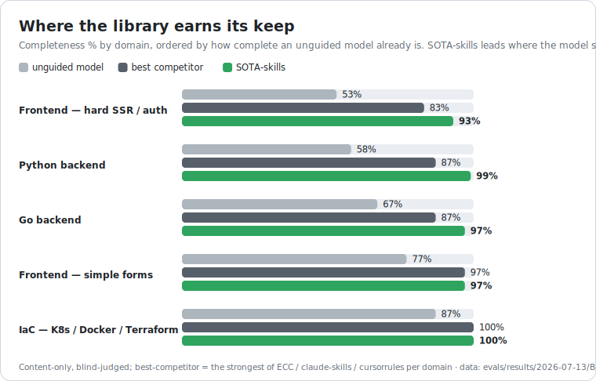

# Eval results — consolidated scoreboard

The single place to see every measured number, newest first. Each row links its
full writeup (method, per-case data, limitations). All runs are clean raw-API
(OpenRouter, no sota config), a **different** model grades each artifact **blind**
to which arm produced it, and every harness is in [`evals/`](../). Reproduce any
row from the command shown in its writeup.

## 1. Efficacy vs. an unguided model

Same model, same task, library loaded vs. nothing.

| Dimension | Without | With SOTA | Lift | Samples | Source |
|---|---|---|---|---|---|
| **Completeness** (7 build tasks) | 0.60 | **1.00** | **+0.39** | 3×, temp 0.7 | [MULTI-SAMPLE](2026-07-13/MULTI-SAMPLE.md) |
| **Freshness** (32 current-2026 facts) | 0.44 | **0.97** | **+0.53** | 3×, temp 0.7 | [MULTI-SAMPLE](2026-07-13/MULTI-SAMPLE.md) |
| Routing (20 tasks) | 0.90 | **1.00** | **+0.10** | 3×, temp 0.7 | [MULTI-SAMPLE](2026-07-13/MULTI-SAMPLE.md) |
| Silent-control detection (15 inert-control cases) | 0.92 | **0.99** | **+0.07** | 5×, temp 1.0 | [SILENT-FAILURE](2026-07-20/SILENT-FAILURE.md) |
| Audit (14 hard snippets) | 1.00 | 1.00 | +0.00 | 1× | [BASELINE](2026-07-10/BASELINE.md) |
| Cross-file audit (8-defect repo) | 1.00 | 1.00 | +0.00 | 2 models | [REPO-AUDIT](2026-07-13/REPO-AUDIT.md) |

The with-library arm is **near-zero variance** on every value dimension
(completeness ±0.01 across-case sd, routing/freshness ±0.00); the sampling wobble
is all in the unguided arm. Audit is +0.00 and reported, not hidden — a capable
model already recognizes vulnerabilities, even cross-file when the repo fits in
context. The real remaining audit frontier is an **agentic large-repo** audit
(too big to hold at once); logged in the [roadmap](../../docs/ROADMAP.md).

**Silent-control detection is the one audit-family dimension that does NOT
saturate** (0.92 unguided) — inert controls are harder for a base model than
ordinary vulnerabilities. But an **ablation isolating the rule file written for
this class (`sota-code-security` rules/10) returned no resolvable contribution**
(+0.00 to +0.07 across four runs, with a per-arm spread of the same size at
n=15). No lift is claimed for that file. The eval design is the limiting factor:
both arms must be *told* to look for inert controls, and that framing is itself
the lens the rule teaches — so what the rule actually adds (asking the question
unprompted) is what the design cannot measure. Details and limitations in
[SILENT-FAILURE.md](2026-07-20/SILENT-FAILURE.md).

**Regression check (2026-07-16).** Three guidance changes adopted from an external
review (negative routing cross-refs; a plan-concreteness clause in BUILD step 3; a
new "claim done only with evidence" operating principle) were regression-tested by
re-running this 3× completeness eval — because our own
[context-rot finding](../../docs/WHY-COMPLETENESS-RESIDUAL.md) warns that *adding*
guidance text can lower salience. Result: with-arm **0.991** (was 0.996), lift
**+0.385** (was +0.395) — statistically unchanged (Δ −0.005, inside the run's
sampling noise; the two dipped cases have an **empty aggregate missing-set**, i.e.
no cross-cutting concern was systematically dropped, and c7 — the prior wobbler —
went to 1.00). Routing was re-run too (principle 6 is added to the router, which
the routing eval pastes whole): with-arm **held at 1.00** (n=3, no misses), lift
+0.09. The changes are kept. Raw:
`2026-07-13/completeness-3sample-postadopt.json` + `routing-3sample-postadopt.json`.

## 2. Live-agent validation

Does the paste-based completeness eval reflect a real router-driven agent?

| Test | Result | Source |
|---|---|---|
| 7 live sub-agents, real router BUILD workflow, blind judge | **0.987** (6/7 perfect) ≈ the 0.988 paste-simulation | [LIVE-BUILD](2026-07-13/LIVE-BUILD.md) |

The simulation is a faithful proxy, and the self-audit gate caught real bugs live
(a prod `/docs` exposure, an unbounded DB critical section, a task-cancellation leak).

## 3. Competitor benchmark — SOTA vs. the most popular libraries

Content-only (SOTA's self-audit **off**), same rubric, blind judge, on the 7
Python/FastAPI backend completeness tasks. Targets validated live via the GitHub
API. This is the Python backend row of a broader picture — the five-domain breadth
run below ([BREADTH.md](2026-07-13/BREADTH.md)) shows the lead tracks the **unguided
baseline** (task incompleteness), not the domain.

  <picture>
    <source media="(prefers-color-scheme: dark)" srcset="../../assets/benchmark-dark.svg">
    
  </picture>

One consolidated view — every competitor's standing in a single table. Scores are
**% of a fixed best-practice rubric the generated code actually implements**
(blind-judged); higher is better.

| Library | Stars | Completeness (7 backend tasks) | Confidence (3 tightest, 3×) | Gap vs SOTA-skills | This library vs SOTA-skills — won / tied / lost¹ |
|---|---|---|---|---|---|
| [**SOTA-skills**](https://github.com/martinholovsky/SOTA-skills) | — | **99%** | **98%** | — | — |
| [affaan-m/ECC](https://github.com/affaan-m/ECC) | ~230k | 87% | 87% | −12 pts | 0 / 2 / 5 |
| [PatrickJS/awesome-cursorrules](https://github.com/PatrickJS/awesome-cursorrules) | ~40k | 83% | 82% | −16 pts | 0 / 0 / 7 |
| [alirezarezvani/claude-skills](https://github.com/alirezarezvani/claude-skills) | ~23k | 81% | 82% | −17 pts | 0 / 1 / 6 |
| unguided model | — | 58% | 65% | −40 pts | — |

¹ **This library's record against SOTA-skills**, across the 7 build tasks (how many
that library scored *higher than* / *equal to* / *lower than* SOTA-skills,
single-sample). Read it on the library's own row: `0 / 2 / 5` on the
[affaan-m/ECC](https://github.com/affaan-m/ECC) row = ECC **won 0, tied 2, lost 5**.
**No competitor won a single task against SOTA-skills** (on backend).

**Breadth — the lead tracks the unguided baseline, not the domain** (5 domains).
SOTA-skills leads where a base model ships *incomplete* code and ties where it's
already near-complete. Ordered by unguided baseline, the green lead appears only
where the unguided bar is low:

  <picture>
    <source media="(prefers-color-scheme: dark)" srcset="../../assets/breadth-dark.svg">
    
  </picture>

| Domain | Unguided | SOTA-skills | best competitor | SOTA lead |
|---|---|---|---|---|
| Frontend — hard SSR/auth | 53% | **93%** | 83% | **+10** |
| Python backend | 58% | **99%** | 87% | **+12** |
| Go backend | 67% | **97%** | 87% | **+10** |
| Frontend — simple forms | 77% | 97% | 97% | +0 |
| IaC (K8s/Docker/TF) | 87% | 100% | 100% | +0 |

Clean threshold near **0.7 baseline**: below it (production backend in any language,
complex/security-sensitive frontend) SOTA-skills leads by ~10 pts; above it (simple
UI, templated infra) everyone converges. So the win isn't "backend" — it's **wherever
the base model's default is incomplete.** The mechanism: the library forces in the
concerns a base model silently omits, and that headroom is large only when the missing
pieces need non-trivial added logic (rate-limit middleware, a server-side auth check),
small when they're a well-known template field the model already emits (a K8s
`securityContext`, a React controlled input). Per-domain notes + raw data:
[BREADTH.md](2026-07-13/BREADTH.md).

SOTA-skills **wins or ties all 21 head-to-head cases and loses none.** The
confidence check confirms it isn't noise: gaps match the full run, and
**SOTA-skills' worst sample ≥ each competitor's best sample** on every tight case.
Competitors are legitimate (all beat an unguided model by +17 to +28 pts) but drop
the cross-cutting non-negotiables (rate limiting, transport, tests) — even the
~230k-star [affaan-m/ECC](https://github.com/affaan-m/ECC)
omits rate limiting on 3 of 7 tasks. Full method + honest limits (backend + frontend, content-only, bundle-size
asymmetry): [COMPETITOR-BENCHMARK](2026-07-13/COMPETITOR-BENCHMARK.md).

## 4. Skill-application decay over a long session

Does a rule loaded early stop being applied as the session grows?
([`run-decay.py`](../run-decay.py); the mechanisms that fight it live in
[docs/CONTEXT-MANAGEMENT.md](../../docs/CONTEXT-MANAGEMENT.md).)

| arm | K=0 | K=15 | K=30 turns of filler | Source |
|---|---|---|---|---|
| guidance at turn 1 | 1.00 | 1.00 | **1.00** (no decay) | [DECAY](2026-07-13/DECAY.md) |
| no guidance (control) | 0.40 | 0.40 | 0.40 | |

First run: **no decay at moderate scale** — an ~18.6K-token (~72 KB) guidance block held after 30
unrelated turns. This *bounds* the problem but doesn't find the breaking point (the
filler is too small to dilute the anchor); scaling the test up needs a top-up.
*(roadmap item 5, still open.)*

## 5. Description-based routing — do the negative cross-refs help? (A/B, +0.00)

Skill descriptions carry negative cross-references ("Not for X — use sota-Y") to
disambiguate confusable siblings. This is the path a skill **auto-loader** uses
(pick from the description catalogue), distinct from the router table §1 measures.
[`run-desc-routing.py`](../run-desc-routing.py) A/Bs the *same* catalogue with vs
without those clauses on 10 adversarially-confusable tasks (each names the correct
skill and the tempting sibling), 3× temp 0.7, objective name-match scoring.

| arm | correct | distractor-pick | Source |
|---|---|---|---|
| with cross-refs | 0.80 | **0.00** | [desc-routing-3sample.json](2026-07-13/desc-routing-3sample.json) |
| without cross-refs | 0.80 | **0.00** | |

**Honest +0.00.** The model **never** routed to the warned-against sibling in
*either* arm (distractor-pick 0.00 across all 10 cases × 3 samples, perfectly
steady) — so the cross-ref had nothing to fix here. The two non-`expect` picks are
*defensible co-answers*, not distractor mis-routes (a goroutine-race task → the Go
language skill; pod-securityContext hardening → `sota-sandboxing`, which covers pod
security), and they are identical in both arms. Like audit (+0.00), a capable model
already does the easy version: the description-selection path is **saturated** for a
frontier model on these pairs. The cross-refs are kept anyway — zero runtime cost,
harmless, and plausibly useful for weaker/smaller models or genuinely ambiguous
phrasings outside this set (a prediction, not measured). No routing lift is claimed.

## Not yet measured (open)

- **Competitor breadth — DONE (5 domains).** The lead tracks the unguided baseline,
  not the domain (table above; [BREADTH.md](2026-07-13/BREADTH.md)). Data pipelines /
  mobile / CLI remain untested, but the baseline-driven pattern is established.
- **As-deployed competitor comparison** — each library with its own method (not
  content-only). SOTA-skills' self-audit is *off* in this run, so an as-deployed
  run would *plausibly* favor SOTA-skills — but that is a prediction, **not
  measured** (a competitor's own method could help it too).
- **Full-7 multi-sample** of the competitor arms (only the 3 tightest done).

## The three-layer story

SOTA **lifts an unguided model** where it matters (completeness +0.39, freshness
+0.53); that lift **reproduces in a live agent** (0.99); and it **beats the most
popular competing libraries** head-to-head **on tasks a base model gets incomplete**
(production backend in any language, complex/security-sensitive frontend: ~+10 pts) —
while honestly bounding it: on tasks the base model already handles well (simple UI,
templated infra) everyone converges. The lead tracks task incompleteness, not the
domain. Boundaries stated, not buried.
